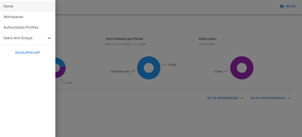

# Acceso a Admin App

Para ingresar a la herramienta de administración, puedes dirigirte al menú lateral de la herramienta _**Build**_ y pulsar _**Admin App**_ o bien acceder a la URL  [https://app.rpaconnect.io/admin/](https://app.rpaconnect.io/admin/). En caso de no tener una sesión activa, se te solicitará que inicies sesión para continuar.

<figure><figcaption>
Acceso a Admin App
</figcaption></figure>

Al ingresar, encontrarás el panel principal con las estadísticas de uso de tus formularios y algunos accesos directos de utilidad. Dirígete al menú lateral para desplegar todas las opciones de gestión.

<figure><figcaption>
Herramientas de gestión
</figcaption></figure>

Veamos la principal función de cada herramienta para luego revisarlas en detalle:

* **Workspaces:** permite gestionar los espacios de trabajo de la plataforma, organizando los formularios y plantillas que correspondan a cada proyecto.
* **Authorization Profiles:** brinda opciones para configurar los roles de los usuarios respecto de los formularios de un espacio de trabajo.&#x20;
* **Users And Groups:** permite dar de alta y dar de baja usuarios, organizarlos en grupos y configurar sus permisos de uso de la plataforma.

Comenzaremos por esta última herramienta. Haz clic sobre la opción _**User and Groups > Users**_ y sigue avanzando para aprender a utilizarla.
