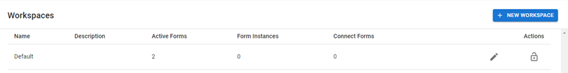
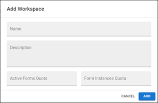
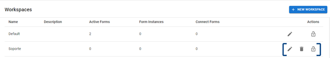
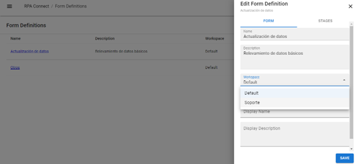
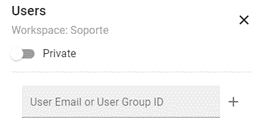

# Espacios de trabajo

Los workspaces permiten segmentar y organizar los formularios creados en la plataforma, por ejemplo, agrupándolos por proyecto o por área (logística, compras, producción, etc.).

Desde el menú lateral, dirígete a _**Workspaces**_. Podrás ver el listado de espacios de trabajo de tu ambiente, la cantidad de formularios activos en cada uno de ellos (Active Forms), las instancias de formulario existentes (Form instances) y los formularios de tipo Connect que incluyan, es decir, aquellos que estén marcados como _**Connect only**_ solo podrán ser asignados a usuarios Connect (Connect Forms).

<figure><figcaption>
Pantalla de inicio de la sección <em>Worskpaces</em>
</figcaption></figure>

Haz clic en _**New workspace**_ para generar un nuevo formulario. Se desplegará una ventana donde podrás establecer los siguientes datos:

* **Name:** nombre con el que identificarás al espacio de trabajo (por ejemplo, el nombre del proyecto o del área a la que corresponde).
* **Descripción:** una breve reseña de las características de dicho espacio.
* **Active Forms Quota:** número máximo de plantillas de formulario activas que podrá contener este espacio de trabajo.
* **Form Instances Quota:** cupo de instancias de formulario mensuales que podrán enviarse.

Pulsa _**Add**_ para guardar.

<figure><figcaption>
Creación de un espacio de trabajo
</figcaption></figure>

Una vez que el formulario esté creado, aparecerá en el listado junto a tres posibles acciones: editar, eliminar y asignar usuarios. A continuación, veremos qué significa cada una de ellas.

<figure><figcaption>
Acciones vinculadas a los espacios de trabajo
</figcaption></figure>

Desde el ícono con forma de lápiz, podrás editar los datos del workspace, tales como nombre, descripción y cupo máximo de plantillas e instancias de formulario activas.

Desde el ícono de cesto, podrás eliminar el workspace. Ten presente que _**Admin App**_ solo te permitirá eliminar aquellos espacios de trabajo que no contengan formularios activos por lo que, en caso de que desees borrar un workspace, pero el mismo esté siendo utilizado, deberás dirigirte a la aplicación _**Build**_ y eliminar sus formularios o moverlos a uno distinto desde el botón de edición:

<figure><figcaption>
Selección de workspace desde un formulario
</figcaption></figure>

Desde el ícono de candado, podrás establecer la configuración de privacidad. Por defecto, cada workspace nuevo se crea en modo privado, por lo que no será visible para los usuarios.

<figure><figcaption>
Configuración de privacidad de un grupo
</figcaption></figure>

Puedes pulsar sobre el toggle de privacidad para cambiar el estado del workspace de privado a público (lo que lo volverá visible para todos los usuarios), o bien asignar usuarios puntuales al espacio de trabajo, del mismo modo que grupos, copiando y pegando el ID que se generó para éste.


Configuración de un Workspace


Una vez que tu espacio de trabajo sea visible, podrás seleccionarlo como workspace para los nuevos formularios que crees en la aplicación _**Build**_, así como, desde el botón de edición, asignar plantillas ya existentes al nuevo espacio de trabajo.
