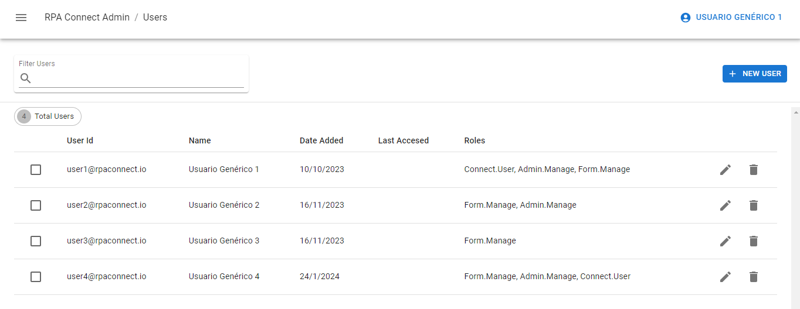
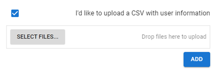

# Gestión de usuarios y grupos

Los usuarios incluyen a todas las cuentas que se encuentran activas en tu ambiente de la plataforma y tienen acceso a RPA Connect, cada una de ellas con sus roles y permisos. A su vez, es posible organizar a los usuarios en grupos, a los cuales también se pueden asignar propiedades específicas, tal como veremos a continuación.

## Usuarios

Al ingresar a la sección _**Users**_, encontrarás un listado con todos los usuarios activos en la plataforma. En caso de que este listado sea numeroso, siempre puedes utilizar el filtro con un ícono de lupa para buscar a un usuario específico.

<figure><figcaption>
Pantalla principal de la sección <em>Users</em>
</figcaption></figure>

Desde _**Admin App**_ puedes asignar, añadir o restringir distintos tipos de roles a los usuarios. Los mismos se sintetizan en:

* **Form Manage:** permite ingresar a la herramienta de desarrollo _**Build**_. Solo los usuarios que tengan asignado este rol podrán acceder a la creación y gestión de formularios, mientras que los demás recibirán un mensaje de error al intentar ingresar en la aplicación.
* **Admin Manage:** habilita el acceso a la aplicación de administración. Quienes posean este rol serán capaces de gestionar los usuarios de la plataforma y configurar todas las opciones que veremos en esta sección.
* **Connect User:** atribuye una propiedad específica a los usuarios por la cual pueden asignárseles aquellos formularios que hayan sido definidos como _**Connect only**_, marcando dicha casilla de opción en la ventana de edición de formularios de la aplicación _**Build**_.

Los roles son específicos e independientes entre sí, por lo que podrás asignar a un mismo usuario uno, varios o todos los roles, según las funciones y acciones que necesite llevar adelante.&#x20;

Para dar de alta un nuevo usuario, haz clic sobre el botón _**New user**_, asigna los roles que desees al usuario y luego ingresa su dirección de correo electrónico y el nombre que le será asignado:

_\[VIDEO: Alta de un usuario]_

En caso de que necesites dar de alta varios usuarios con los mismos permisos, puedes agregar más filas pulsando sobre la opción _**Add row**_.

<figure><figcaption>
Carga de múltiples usuarios
</figcaption></figure>

Si ya dispones de una planilla generada en Excel con esta información, _**Admin App**_ brinda una opción para importarla directamente y economizar los tiempos del proceso. Activa la casilla de verificación “I’d like to upload a CSV with user info”, y pulsa sobre _**Select files…**_, selecciona el archivo que contenga las columnas de email y nombre (o arrástralo y suéltalo en el campo con la leyenda “Drop files here to upload”). Asigna los permisos que desees y pulsa _**Add**_ para finalizar.

<figure><figcaption>
Importación de un archivo CSV
</figcaption></figure>

Para eliminar un usuario, pulsa el ícono de cesto. Ten presente que el sistema no te solicitará una confirmación antes de eliminarlo.

Para editar los datos de un usuario, haz clic sobre el ícono de lápiz. Puedes modificar la dirección de correo/email/ID del usuario, así como retirar permisos existentes o asignar otros.

<figure><figcaption>
Edición y eliminación de usuarios
</figcaption></figure>

La edición también te permitirá gestionar los grupos en los que se encuentre un usuario. Para poder asignarlo a un nuevo grupo, es necesario que éste haya sido creado con antelación. A continuación, conocerás cómo crear un nuevo grupo con roles específicos y cómo añadir usuarios al mismo.

## Grupos

Despliega el menú lateral y dirígete a la sección _**Users And groups > Groups**_. Desde allí podrás gestionar todos los grupos que hayas creado. Para generar uno nuevo, haz clic en _**New group**_.&#x20;

<figure><figcaption>
Creación de grupos
</figcaption></figure>

Se abrirá una ventana donde podrás denominar al grupo y establecer los roles que le correspondan. Dependiendo del flujo de trabajo escogido y la distribución interna de tareas, es posible crear, por ejemplo, un grupo con el rol _**Form.Manage**_ para los desarrolladores de formularios y otro con el rol _**Admin.Manage**_ para quienes gestionen las altas y bajas de usuarios.

<figure><figcaption>
Definición de propiedades de un grupo
</figcaption></figure>

Para finalizar, haz clic en _**Add group**_. El nuevo grupo aparecerá en el listado de tu pantalla principal mostrando un ID que le ha sido asignado automáticamente. Más adelante conocerás cómo utilizarlo. Una vez que el grupo esté creado, puedes acceder desde el botón de edición para definir a los usuarios que lo integrarán.

También podrás cambiar el nombre y los roles asignados. Deberás hacer clic en _**Save**_ para que los cambios se vean reflejados.

<figure><figcaption>
Roles de un grupo
</figcaption></figure>

Prueba generando un grupo con el nombre “Editores” y asígnale el rol _**Form.Manage**_. Los usuarios que sean añadidos a este grupo no podrán administrar a otros usuarios ni acceder a formularios Connect, ya que solamente tendrán atribuidos permisos para desarrollar formularios en la aplicación _**Build**_. Haz clic en _**Add group**_ para finalizar y luego edita el grupo para añadir a dos miembros.

Puedes añadir o quitar miembros de un grupo desde el botón de edición, siempre asegurándote de que los mismos estén dados de alta desde la sección _**Users**_. También puedes hacerlo en dicha sección, ingresando a un usuario y seleccionando el grupo para agregar o eliminar.

_\[VIDEO: Creación de un grupo]_

Puedes añadir o quitar miembros de un grupo desde el botón de edición, siempre asegurándote de que los mismos estén dados de alta desde la sección _**Users**_. También puedes hacerlo en dicha sección, ingresando a un usuario y seleccionando el grupo para agregar o eliminar.

<figure><figcaption>
Gestión de  grupos desde la sección <em>Users</em>
</figcaption></figure>
