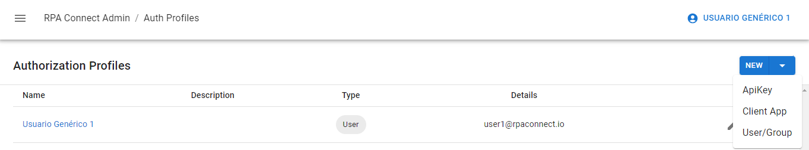

# Roles y permisos

Existen opciones de configuración avanzada que te permitirán establecer roles a los usuarios y grupos habilitados en la plataforma respecto a cada espacio de trabajo, así como a plantillas de formulario específicas. A diferencia de _**Users And Groups**_, que mediante el rol _**Form.Manage**_ concede o restringe el acceso a la aplicación _**Build**_, con _**Authorization profiles**_ puedes tener un control más estricto de los permisos que tengan los usuarios con acceso al portal sobre cada contenido puntual de esta aplicación.

Para comenzar, dirígete al apartado _**Authorization profiles**_ desde el menú lateral, donde encontrarás una lista con los perfiles activos. Haciendo clic sobre el nombre de un perfil, que se muestra en color azul, puedes administrar los permisos que tenga habilitados. Cada perfil puede asumir uno entre tres tipos de roles posibles sobre un espacio de espacio de trabajo, los cuales se seleccionan pulsando la flecha a la derecha del nombre del workspace:

* **None:** no posee ningún permiso, por lo no podrá ver los formularios en su página de inicio del portal de RPA Connect ni podrá trabajar sobre las instancias creadas.
* **Contributor:** las plantillas de ese workspace estarán disponibles en su pantalla de inicio y podrá generar nuevas instancias de formulario.
* **Manager:** además de contar con los permisos de _**Contributor**_, también puede visualizar la totalidad de las instancias de formulario enviadas por los perfiles con acceso a la plantilla.

<figure><figcaption>
Visualización de roles asignados
</figcaption></figure>

Pulsando sobre la flecha a la izquierda del nombre del workspace, puedes desplegar el listado de plantillas de formulario que estén contenidas en él y asignar también roles específicos a cada una de ellas. Sumadas a las tres opciones que vimos anteriormente, se encontrará la opción _**Inherit**_, es decir, heredar sin cambios el permiso atribuido para el espacio de trabajo.

<figure><figcaption>
Definición de roles dentro de un workspace
</figcaption></figure>

El botón _**New**_ en la esquina superior derecha te permitirá generar un nuevo perfil, existiendo tres tipos posibles: _**User/Group**_, _**ApiKey**_ y _**Client App**_. Nos centraremos en los primeros dos.

<figure><figcaption>
Perfiles de Admin App
</figcaption></figure>

## Perfil de usuario o grupo

Partiendo de lo visto en la sección anterior, comenzaremos por los usuarios y grupos. Haz clic en _**New > User/Group**_ y añade un nombre y, si lo deseas una descripción para dicho perfil. Selecciona el tipo _**User**_ e ingresa el correo electrónico con el que esté registrado el usuario en _**Users And Groups**_. Prueba establecer distintos tipos de perfiles para los espacios de trabajo y los formularios dentro de ellos. Los cambios se reflejarán en la página de inicio del portal RPA Connect y en la sección de envío de las instancias de formulario donde, dependiendo del nivel de autorización concedido, los usuarios podrán visualizar mayor o menor cantidad de información.

Pulsa _**Save changes**_ para terminar.

_\[VIDEO: Creación de un perfil]_

Para añadir un grupo, sigue los mismos pasos que en el punto anterior, pero selecciona el tipo _**Group**_ en lugar de _**User**_. A diferencia de los espacios de trabajo, en este caso no deberás ingresar un ID, sino que la aplicación mostrará un desplegable donde podrás elegir el grupo que desees entre aquellos que estén dados de alta.

<figure><figcaption>
Perfil para un grupo
</figcaption></figure>

## ApiKey

La _**ApiKey**_ permite la autenticación desde los robots, automatización o código que interactúa con los formularios. Puedes asignar a este tipo de perfil los mismos roles de un usuario o grupo.

Para generar un nuevo perfil, haz clic en _**New > ApiKey**_, ingresa un nombre y, si lo deseas, una descripción y pulsa _**Add**_. El sistema te devolverá una clave única que deberás copiar y guardar.

_\[VIDEO: Creación de una ApiKey]_

Ten presente que cuando utilices la API de RPA Connect, deberás usar esta _**ApiKey**_ para concretar la autenticación.
