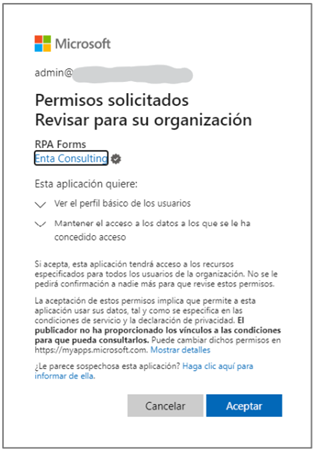

# Autorización de sincronización

Cuando se habilita un ambiente nuevo, es necesario en primer lugar autorizar la sincronización con Microsoft Entra ID, brindando el consentimiento del administrador.

Para comenzar, un usuario con permiso de administrador global de Entra ID debe acceder a la URL https://app.rpaconnect.io/Account/AdminConsen?tenantid=\<tenantid> (donde _**\<tenantid>**_ será el ID del ambiente donde se desea realizar el proceso) y autenticarse.

Tras la autenticación, se mostrará la siguiente ventana, informando los permisos necesarios para poder establecer la sincronización. Se debe pulsar _**Aceptar**_ para continuar.

<figure><figcaption>
Aceptación de permisos
</figcaption></figure>

Una vez completado con éxito este paso, se mostrará un mensaje de confirmación notificando que el consentimiento fue aceptado y quedará autorizada la conexión. Esto generará un acceso al aplicativo de RPA Connect en Entra ID y también permitirá que los usuarios puedan ingresar a la aplicación RPA Connect con sus cuentas corporativas.

Para ello, recuerda seleccionar la opción “Iniciar sesión con su cuenta de trabajo” al momento de acceder a la plataforma, tal como vimos en el [Inicio rápido](../../).

\
