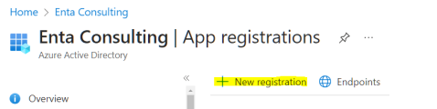
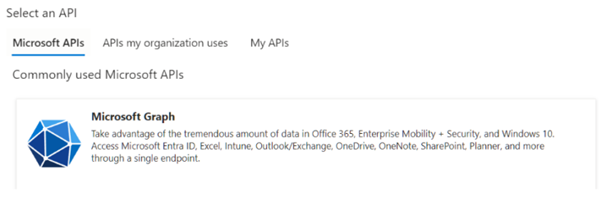
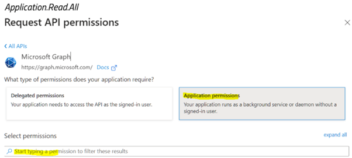
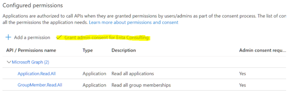

# Configuración de notificaciones Microsoft Teams

Para permitir que la aplicación RPA Connect genere notificaciones a través de Teams, es necesario en primer lugar crear la aplicación correspondiente. Desde Microsoft Entra ID, dirígete a _**App Registration > New registration**_.

<figure><figcaption>
Registro de una aplicación
</figcaption></figure>

Ingresa el nombre que desees para la aplicación (por ejemplo, RPA Connect – Notifications y selecciona la opción _**Accounts in this organizational directory only**_. Haz clic en el botón _**Register**_ para confirmar.

A continuación, dirígete a _**API Permission**_ y presiona _**Add a Permission**_. Selecciona la API de Microsoft Graph para configurar sus permisos. Esto permitirá enviar las notificaciones a los grupos y usuarios.

<figure><figcaption>
Selección de API
</figcaption></figure>

Haz clic sobre _**Application permissions**_ y utiliza el buscador para hallar los permisos _**GroupMember.Read.All**_ y _**Application.Read.All**_.

<figure><figcaption>
Permisos de la aplicación
</figcaption></figure>

Una vez que los hayas visualizado, activa la casilla _**Grant admin consent…**_ para autorizar su uso.

<figure><figcaption>
Autorización de permisos
</figcaption></figure>
