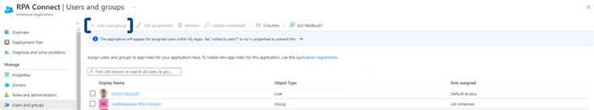
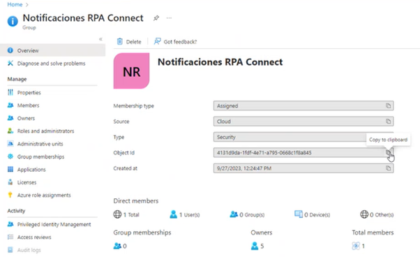
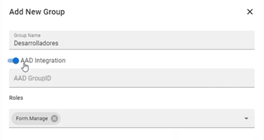

# Gestión de grupos AD

Como analizamos anteriormente, existen diversos roles al interactuar con RPA Connect, cada uno de ellos con características y funcionalidades específicas. Desde Microsoft Entra ID, es posible generar nuevos grupos con sus respectivos permisos. Veamos cuáles son:

* **Desarrolladores:** son los usuarios que tienen acceso a la aplicación _**Build**_ ([https://app.rpaconnect.io/build](https://app.rpaconnect.io/build)) y están a cargo de la creación y edición de formularios, pudiendo diseñar nuevas plantillas y, en función de los permisos de los que dispongan, gestionar las instancias de formulario. **A este tipo de rol le corresponderá el permiso "Manage form definitions".**
* **Administradores:** son quienes poseen acceso a la aplicación _**Admin**_ ([https://app.rpaconnect.io/admin](https://app.rpaconnect.io/admin)) y pueden gestionar las altas y bajas de usuarios, la configuración de grupos, la asignación de roles y permisos, y el acceso a los formularios y espacios de trabajo. **A este tipo de rol le corresponderá el permiso "Manage Admin settings".**
* **Usuarios Connect:** son aquellos a los que pueden asignársele formularios definidos como _**Connect Only**_ y pueden acceder al Portal ([https://app.rpaconnect.io/portal](https://app.rpaconnect.io/portal)) para visualizarlos. **A este tipo de rol le corresponderá el permiso "Connect user".**

Para crear un nuevo grupo desde Microsoft Entra ID, dirígete al apartado _**Enterprise applications > RPA Connect > Users and Groups**_ y pulsa _**Add user/group**_.

<figure><figcaption>
Creación de un grupo en Microsoft Entra ID
</figcaption></figure>

A continuación, selecciona el usuario o grupo y sus correspondientes permisos. Pulsa _**Aceptar**_ para confirmar el proceso.\
Prueba creando un grupo para los usuarios responsables de la generación de nuevos formularios, al cual llamaremos “Desarrolladores”. Establece como permiso para el mismo _**Manage form definitions**_.

Al crear un nuevo grupo, se generará un ID específico para el mismo, el cual podrá copiarse y utilizarse para gestionar este grupo en la plataforma de RPA Connect.

<figure><figcaption>
ID de un grupo
</figcaption></figure>

Copia el ID correspondiente al grupo que has creado e ingresa a _**Admin App**_. Dirígete a _**Users And Groups > Groups**_ y haz clic en _**New Group**_.

Completa con el nombre y el rol definidos y pulsa sobre el toggle _**AAD Integration**_. Aparecerá un nuevo campo donde podrás pegar el ID correspondiente.

<figure><figcaption>
AAD Integration
</figcaption></figure>

De este modo, se importará el grupo creado en Microsoft Entra ID y quedará activada la conexión.
