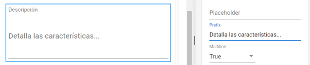

# Apariencia

En el apartado _**Appearance**_ puedes configurar diversas opciones vinculadas a la visualización de los campos en el formulario. Aunque este tipo de propiedades se centra en elecciones de estilo o formato que no influyen de modo directo en la funcionalidad de los componentes, es importante tener en cuenta que pueden afectar notablemente su eficacia: un diseño claro y amigable para el usuario favorecerá su correcta administración mientras que un diseño poco intuitivo puede dificultarla.

Veamos cuáles son estas propiedades para los distintos tipos de elementos de formulario. Recuerda que puedes activar el modo _**Preview**_ mientras trabajas para revisar en tiempo real cómo impactan las distintas elecciones que realices.

<figure><figcaption>
Apartado <em><strong>Appearance</strong></em> y ubicación del botón de <em><strong>Preview</strong></em>.
</figcaption></figure>

## Columnas y campos estáticos

Tanto las columnas como los campos estáticos _**Text**_ e _**Image**_ poseen propiedades específicas que definen su posicionamiento en pantalla. La propiedad _**Vertical align**_ es común a todos ellos y se refiere a la ubicación que los componentes adoptan respecto al margen superior e inferior de la sección o columna que los contiene. Esta propiedad puede configurarse como _**Top**_ (se alinea en la parte superior), _**Center**_ (se alinea en el centro) o _**Bottom**_ (alineado en la parte inferior).

<figure><figcaption>
Opciones de la propiedad <em><strong>Vertical align</strong></em>
</figcaption></figure>

Otra propiedad que afecta solamente a las columnas es _**Spacing**_, que se refiere al espacio vertical existente entre los elementos de una misma columna. Cuanto mayor sea este número, más separación existirá entre los campos.

La propiedad _**Align**_ que se encuentra tanto en los campos de texto como de imagen, funciona de un modo similar pero definiendo el posicionamiento horizontal del contenido. Este puede establecerse en _**Left**_, _**Center**_ o _**Right**_, que indican alineación a la izquierda, al medio o a la derecha respectivamente.

<figure><figcaption>
Opciones de la propiedad <em><strong>Align</strong></em>
</figcaption></figure>

El campo _**Text**_ ofrece una mayor riqueza de opciones, contando con las siguientes propiedades:

<table><thead><tr><th width="147">Propiedad</th><th>Función</th></tr></thead><tbody><tr><td><strong>Margin</strong></td><td>Con valores desde 0 hasta 10, permite escoger el margen de espacio libre alrededor del texto. Un valor más bajo lo posicionará con mayor proximidad a los demás componentes mientras que un valor más alto aumentará la separación.</td></tr><tr><td><strong>Weight</strong></td><td>Permite establecer el peso de la tipografía en Light (ligera), Regular (normal) o Bold (negrita).</td></tr><tr><td><strong>Font style</strong></td><td>Permite seleccionar el estilo de itálica o normal para el texto.</td></tr><tr><td><strong>Text variant</strong></td><td>Ofrece una serie de variantes preconfiguradas con distintos niveles para encabezados, subtítulos, cuerpo de texto y otras opciones.</td></tr></tbody></table>

<figure><figcaption>
Opciones del campo <em><strong>Text</strong></em>
</figcaption></figure>

## Campos dinámicos

Aunque los campos dinámicos presentan rangos de opciones más variados dependiendo de su funcionalidad, en la mayoría de ellos encontrarás las siguientes propiedades de apariencia:

### Mask

Esta propiedad define una estructura para dato solicitado, determinando sus valores posibles. Para utilizar esta propiedad, deberás conocer ciertos parámetros, que definen el tipo de caracteres aceptados en cada espacio de la cadena:

* El caracter "a" representa cualquier letra, es decir que cuando se incluye en la máscara, el usuario solo podrá ingresar un caracter alfabético en ese espacio.
* El caracter '0' representa cualquier número. Al incluirse en la máscara, solo admitirá como válidos para ese espacio los valores desde el 0 al 9.

<figure><figcaption>
Ejemplo de una máscara que admite cuatro caracteres alfabéticos y cuatro caracteres numéricos
</figcaption></figure>

* Si solo se considerará como válida una letra o número particular en ese espacio de la cadena, es necesario ingresar el caracter correspondiente en la máscara.
* Si un caracter de la cadena debe ser específicamente "a" o "0", dado que estos números tienen también una función como letra o número genérica, se debe anteponer la barra "\\" para que solo se acepte ese caracter puntual.
* Pueden agregarse otros caracteres como puntos o guiones a la máscara para que los datos ingreados adopten este formato.

<figure><figcaption>
Ejemplo de la configuración de <em><strong>Mask</strong></em> con distintos caracteres 
</figcaption></figure>

### Placeholder

Establece un texto predeterminado que se muestra al usuario en ese campo, el cual puede utilizarse para brindar ejemplos o sugerencias para completarlo.

<figure><figcaption>
Incorporación de un texto de sugerencia con uso de <em><strong>Placeholder</strong></em>
</figcaption></figure>

### Prefix

Añade una expresión como prefijo a los datos que se ingresen en el campo, por ejemplo, la característica antes de un número de teléfono.

<figure><figcaption>
Establecimiento de un prefijo para un número telefónico
</figcaption></figure>

### Multiline

Puede escogerse el valor _**True**_ si se desea que el campo posea múltiples líneas (para un área de texto más extensa) o _**False**_, si se muestra en un único renglón.

<figure><figcaption>
Generación de espacio adicional definiendo el valor <em><strong>True</strong></em> para la propiedad <em><strong>Multiline</strong></em>
</figcaption></figure>

Ten presente que algunos tipos de campos como _**Date**_ o _**Attachment**_ tendrán menos cantidad de propiedades o bien no mostrarán este apartado, ya que tienen un formato preestablecido que no admite variaciones. Otros campos, como _**Options**_ o _**Boolean**_, tendrán propiedades únicas para los componentes de su tipo, tal como veremos más adelante.
