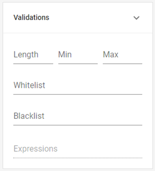

# Validaciones

En el apartado _**Validations**_ puedes establecer distintas condiciones que deberán cumplir los datos ingresados para considerarse como válidos. Configurando estos parámetros, podrás anticiparte a distintas opciones de respuesta y minimizar el riesgo de potenciales errores, por ejemplo, un código que supera el tope de caracteres permitidos.

En general, las validaciones que podrás establecer son:

<table><thead><tr><th width="133">Propiedad</th><th>Características</th></tr></thead><tbody><tr><td><strong>Min</strong></td><td>Se refiere al valor mínimo aceptable para ese campo y se ingresa en números. El tipo de valor varía en función del campo, por ejemplo, en los campos de texto, hace referencia al mínimo de caracteres que puede contener la expresión, mientras que en los campos numéricos, se refiere al número más bajo aceptado.</td></tr><tr><td><strong>Max</strong></td><td>Se utiliza igual que <em><strong>Min</strong></em>, pero define en cambio el valor máximo admitido.</td></tr><tr><td><strong>Whitelist</strong></td><td>
Permite generar un listado de los únicos valores que serán aceptados en ese campo. Para ingresarlos, hay que tipear cada uno y presionar <em>enter</em>, con lo cual se irán guardando y mostrando como etiquetas en la configuración.

A diferencia de los campos con opciones, el usuario no verá este listado, sino que recibirá un mensaje de error aclarando los valores aceptados cuando ingrese uno no admitido.
</td></tr><tr><td><strong>Blacklist</strong></td><td>Se configura del mismo modo que <em><strong>Whitelist</strong></em>, pero al contrario de esta propiedad permite definir una lista de valores que no serán aceptados en ese campo. El usuario podrá ingresar cualquier dato, exceptuando los que estén consignados allí.</td></tr></tbody></table>

<figure><figcaption>
Propiedades de validación
</figcaption></figure>
