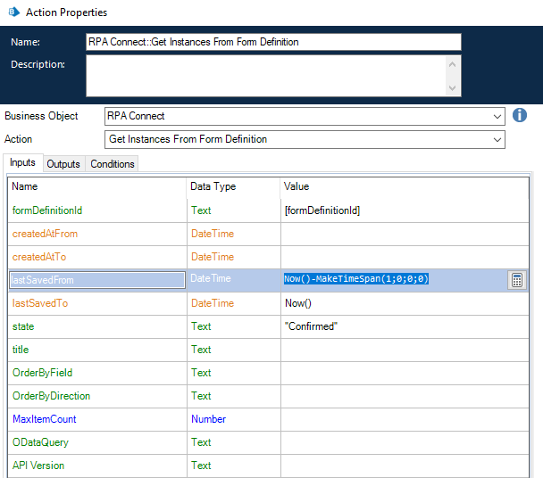

# Consulta de instancias de una plantilla

La acción _**Get instances from form definition**_ permite generar automáticamente un listado de todas las instancias de una plantilla, pudiendo establecer diversos filtros en función de los datos que se desee obtener, así como parámetros para ordenarlos.

<figure><figcaption>
Obtener instancias de un formulario
</figcaption></figure>

Veamos algunas de estas funciones:

* **createdAtFrom/createdAtTo:** permite recabar los datos de un periodo determinado considerando un rango de instancias según las fechas desde cuándo y hasta cuándo fueron creadas
* **lastSavedFrom/lastSavedTo:** se configura del mismo modo que el caso anterior, pero permite la segmentación por el periodo en el cual fueron guardadas
* **state:** permite filtrar por el estado de las instancias (borrador, confirmada y cancelada).
* **title:** permite filtrar en función de los títulos.
* **Order by…:** brinda opciones de ordenamiento de los datos recabados.
