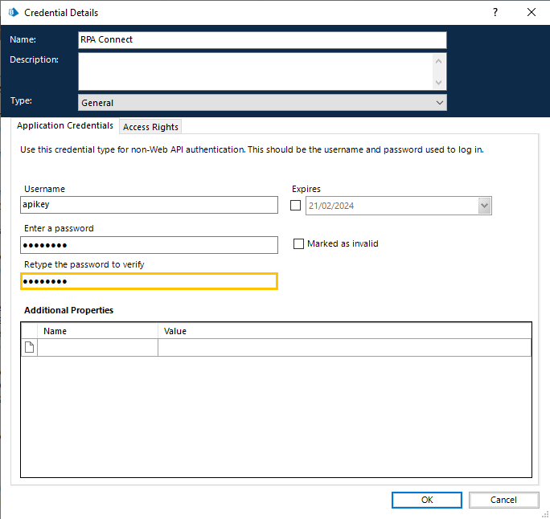

# Creación de una credencial de autenticación

Para comenzar el proceso, dirígete a Authorization Profiles y crea una ApiKey, que será la utilizada por BluePrism. Una vez que la hayas añadido, copia la Apikey que se genera automáticamente tal como vimos anteriormente en el [apartado de Roles y permisos de Admin App](../../administracion/admin-app/roles-y-permisos.md).

A continuación, accede a BluePrism y crea una nueva credencial de autenticación. Ingresa el nombre que desees y selecciona el tipo _**Basic Authentication**_. Establece como usuario “apikey” y, como clave, la Apikey copiada en el paso anterior.

<figure><figcaption>
Creación de una clave de autenticación
</figcaption></figure>

Pulsa _**OK**_ para confirmar y finalizar.
