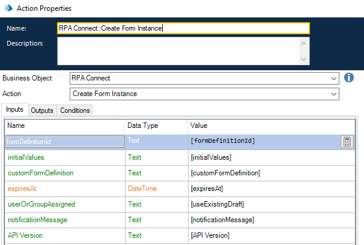

# Generación de una instancia pública de formulario

Cada vez que se genera una instancia de formulario de RPA Connect, se obtiene un ID y un token con vencimiento, el cual permite la creación de un link específico desde el cual acceder a dicha instancia a través del navegador. Veamos cómo se realiza este proceso.

En primer lugar, es necesario realizar la autenticación. Como _**host**_, ingresaremos “[https://app.rpaconnect.io](https://app.rpaconnect.io)” y como _**apikey**_, la clave ApiKey obtenida en la creación de la credencial.

<figure><figcaption>
Valores para la autenticación
</figcaption></figure>

Una vez completada la autenticación, puedes calcular la fecha de vencimiento del token. El periodo de duración por defecto es de 30 días, pero es posible aumentarlo o reducirlo en función de las necesidades puntuales para cada caso.

<figure><figcaption>
Cálculo de la fecha de vencimiento del token
</figcaption></figure>

A continuación, crearemos una instancia de formulario. Para ello, necesitaremos obtener el ID de la plantilla, el cual podemos encontrar en su URL:

<figure><figcaption>
ID de la plantilla en su URL
</figcaption></figure>

En la creación de la instancia, también se incluirá como input la fecha de vencimiento del token según lo configurado anteriormente (_**ExpiresAt**_) y otras opciones avanzadas que veremos más adelante.

<figure><figcaption>
Creación de una instancia de formulario
</figcaption></figure>

Al ejecutarse, esta acción generará tres outputs, los cuales serán:

* **formInstanceId:** el Id de la instancia.
* **sharedFormToken:** el token que permanecerá accesible durante el tiempo establecido anteriormente. Es importante remarcar que, al vencerse el token, la instancia dejará de estar accesible pero la información asociada a ella permanecerá guardada hasta que se la elimine.
* **URL:** dirección accesible desde el navegador que consiste en una cadena conformada por la URL básica de un link público (app.rpaconnect.io/public/fill?token=) y el token.
