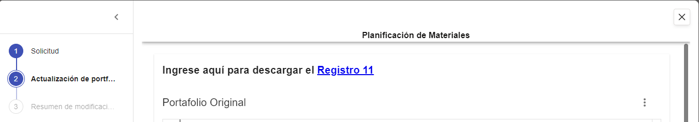

# Otras acciones

Además de la creación y consulta de instancias de un formulario, existen múltiples acciones aplicadas al uso de formularios que aportan un valor adicional y ayudan a optimizar el flujo de trabajo.

Veamos algunas de ellas a continuación.

## **Get Form Instance State**

Devuelve el estado de una instancia de formulario, es decir, si se encuentra en estado de borrador o confirmada. Presenta los siguientes parámetros:

<table><thead><tr><th width="165">Parámetros</th><th width="102">Dirección</th><th width="126">Tipo de dato</th><th>Descripción</th></tr></thead><tbody><tr><td><strong>formInstanceId</strong></td><td>In</td><td>Texto</td><td>ID de la instancia de formulario</td></tr><tr><td><strong>state</strong></td><td>Out</td><td>Texto</td><td>Estado de la instancia de formulario</td></tr><tr><td><strong>lastSaved</strong></td><td>Out</td><td>Texto</td><td>Fecha y hora del último guardado</td></tr><tr><td><strong>Response</strong></td><td>Out</td><td>Colección</td><td>Colección conteniendo todos los datos anteriores de la instancia de formulario</td></tr></tbody></table>

## **Get Form Instance Response**

Incluye las propiedades de _**Get Form Instance State**_ pero permite también recopilar los datos que hayan sido ingresados en una instancia de formulario, mostrándolos como valores. Sus propiedades son las siguientes:

<table><thead><tr><th width="180">Parámetros</th><th width="102">Dirección</th><th width="126">Tipo de dato</th><th>Descripción</th></tr></thead><tbody><tr><td><strong>formInstanceId</strong></td><td>In</td><td>Texto</td><td>ID de la instancia de formulario</td></tr><tr><td><strong>formDefinitionID</strong></td><td>Out</td><td>Texto</td><td>ID de la plantilla a la cual pertenece la instancia</td></tr><tr><td><strong>formInstanceId</strong></td><td>Out</td><td>Texto</td><td>ID de la instancia de formulario, ya que se incluirá en la salida final</td></tr><tr><td><strong>lastSaved</strong></td><td>Out</td><td>Texto</td><td>Fecha y hora del último guardado</td></tr><tr><td><strong>state</strong></td><td>Out</td><td>Texto</td><td>Estado de la instancia de formulario</td></tr><tr><td><strong>values</strong></td><td>Out</td><td>Colección</td><td>Valores ingresados en la instancia de formulario</td></tr><tr><td><strong>Response</strong></td><td>Out</td><td>Colección</td><td>Colección conteniendo todos los datos anteriores de la instancia de formulario</td></tr></tbody></table>

## **Get Form Instance Token**

Permite generar un nuevo token público para una instancia de formulario (por ejemplo, porque se encuentra vencido) definiendo los siguientes parámetros:

<table><thead><tr><th width="184">Parámetros</th><th width="102">Dirección</th><th width="126">Tipo de dato</th><th>Descripción</th></tr></thead><tbody><tr><td><strong>formInstanceId</strong></td><td>In</td><td>Texto</td><td>ID de la instancia de formulario</td></tr><tr><td><strong>expiresAt</strong></td><td>In</td><td>Fecha y hora</td><td>Fecha de vencimiento del token</td></tr><tr><td><strong>formInstanceId</strong></td><td>Out</td><td>Texto</td><td>ID de la instancia de formulario, ya que se incluirá en la salida final</td></tr><tr><td><strong>sharedFormToken</strong></td><td>Out</td><td>Texto</td><td>Token que permite visualizar y modificar la instancia generada</td></tr><tr><td><strong>URL</strong></td><td>Out</td><td>Texto</td><td>Dirección accesible desde el navegador formada por la URL básica y el token</td></tr><tr><td><strong>Response</strong></td><td>Out</td><td>Colección</td><td>Colección conteniendo todos los datos anteriores de la instancia de formulario</td></tr></tbody></table>

## **Set Form Instance Process Info**

Permite brindar a las personas que utilicen el portal o la aplicación de Teams la posibilidad de revisar el estado de los formularios que hayan enviado, el cual se refleja en las columnas “Estado del Proceso” y “Completado”.

<figure><figcaption>
Visualización del estado de un formulario en el Portal
</figcaption></figure>

Esta acción se configura con los siguientes parámetros:

<table><thead><tr><th width="201">Parámetros</th><th width="102">Dirección</th><th width="126">Tipo de dato</th><th>Descripción</th></tr></thead><tbody><tr><td><strong>formInstanceId</strong></td><td>In</td><td>Texto</td><td>ID de la instancia de formulario</td></tr><tr><td><strong>status</strong></td><td>In</td><td>Texto</td><td>Estado de procesamiento de la instancia que se mostrará al usuario</td></tr><tr><td><strong>endState</strong></td><td>In</td><td>Texto</td><td>Estado de procesamiento final, cuyas opciones son “OK” o “Error”</td></tr><tr><td><strong>completionMessage</strong></td><td>In</td><td>Texto</td><td>Mensaje especificando las condiciones en que finalizó la instancia</td></tr></tbody></table>

## **Delete Form Instance**

Permite borrar una instancia de formulario. Sus principales propiedades son:

<table><thead><tr><th width="201">Parámetros</th><th width="102">Dirección</th><th width="126">Tipo de dato</th><th>Descripción</th></tr></thead><tbody><tr><td><strong>formInstanceId</strong></td><td>In</td><td>Texto</td><td>ID de la instancia de formulario</td></tr><tr><td><strong>force</strong></td><td>In</td><td>Flag</td><td>Fuerza la eliminación de una instancia</td></tr></tbody></table>

## **Get Attachments / Download Attachment**

Estas acciones se encuentran estrechamente vinculadas, ya que la primera permite listar todos los archivos adjuntos en los campos de este tipo de determinada instancia, y la segunda, permite descargar todos los archivos del listado obtenido.

Veamos las propiedades de la acción _**Get Attachments**_:

<table><thead><tr><th width="167">Parámetros</th><th width="104">Dirección</th><th width="127">Tipo de dato</th><th>Descripción</th></tr></thead><tbody><tr><td><strong>formInstanceId</strong></td><td>In</td><td>Texto</td><td>ID de la instancia de formulario</td></tr><tr><td><strong>stageIndex</strong></td><td>In</td><td>Número</td><td>Stage del cual se obtienen los adjuntos</td></tr><tr><td><strong>Attachments</strong></td><td>Out</td><td>Colección</td><td>Lista de URLs para descargar los archivos</td></tr></tbody></table>

Por su parte, la acción _**Download Attachment**_ incluye los siguientes parámetros:

<table><thead><tr><th width="171">Parámetros</th><th width="102">Dirección</th><th width="126">Tipo de dato</th><th>Descripción</th></tr></thead><tbody><tr><td><strong>AttachmentURL</strong></td><td>In</td><td>Texto</td><td>URL de la que descargar el archivo</td></tr><tr><td><strong>Path</strong></td><td>In</td><td>Número</td><td>Ruta donde se guardará el archivo descargado</td></tr></tbody></table>

## **Upload FormInstance Resource / Delete FormInstance Resource**

Estas acciones permiten, respectivamente, añadir y eliminar un recurso de una instancia de formulario. El tipo de recursos que se gestionan por esta vía no se encuentran incluidos en el diseño del formulario, sino que se añaden como enlaces externos con material descargable:

<figure><figcaption></figcaption></figure>

Las propiedades a definir para cargar un nuevo recurso son:

<table><thead><tr><th width="171">Parámetros</th><th width="102">Dirección</th><th width="126">Tipo de dato</th><th>Descripción</th></tr></thead><tbody><tr><td><strong>formInstanceId</strong></td><td>In</td><td>Texto</td><td>URL de la que descargar el archivo</td></tr><tr><td><strong>Path</strong></td><td>In</td><td>Número</td><td>Ruta en la cual se adjuntará el archivo</td></tr></tbody></table>

Para eliminarlo, en cambio, deberá establecerse:

<table><thead><tr><th width="171">Parámetros</th><th width="102">Dirección</th><th width="126">Tipo de dato</th><th>Descripción</th></tr></thead><tbody><tr><td><strong>formInstanceId</strong></td><td>In</td><td>Texto</td><td>URL de la que descargar el archivo</td></tr><tr><td><strong>ResourceName</strong></td><td>In</td><td>Texto</td><td>Nombre del recurso del cual se quiere eliminar el adjunto</td></tr></tbody></table>
