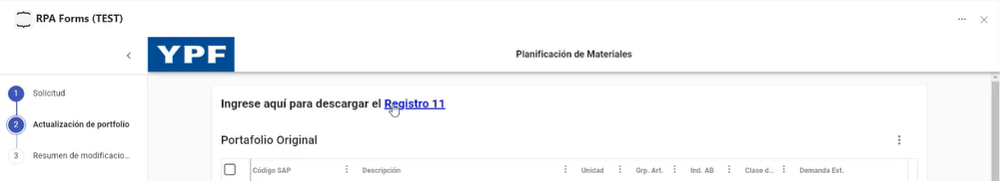

# Acciones vinculadas a archivos

En este apartado analizaremos cómo consultar y descargar los archivos adjuntos de un formulario así como añadir y eliminar los recursos asignados a una instancia de formulario determinada.

## **Get Attachments / Download Attachment**

Estas acciones se encuentran estrechamente vinculadas, ya que la primera permite listar todos los archivos adjuntos en los campos de este tipo de determinada instancia, y la segunda, permite descargar todos los archivos del listado obtenido.

Veamos las propiedades de la acción _**Get Attachments**_:

<table><thead><tr><th width="167">Parámetros</th><th width="104">Dirección</th><th width="127">Tipo de dato</th><th>Descripción</th></tr></thead><tbody><tr><td><strong>formInstanceId</strong></td><td>In</td><td>Texto</td><td>ID de la instancia de formulario</td></tr><tr><td><strong>stageIndex</strong></td><td>In</td><td>Número</td><td>Stage del cual se obtienen los adjuntos</td></tr><tr><td><strong>Attachments</strong></td><td>Out</td><td>Colección</td><td>Lista de URLs para descargar los archivos</td></tr></tbody></table>

Por su parte, la acción _**Download Attachment**_ incluye los siguientes parámetros:

<table><thead><tr><th width="171">Parámetros</th><th width="102">Dirección</th><th width="126">Tipo de dato</th><th>Descripción</th></tr></thead><tbody><tr><td><strong>AttachmentURL</strong></td><td>In</td><td>Texto</td><td>URL de la que descargar el archivo</td></tr><tr><td><strong>Path</strong></td><td>In</td><td>Número</td><td>Ruta donde se guardará el archivo descargado</td></tr></tbody></table>

## **Upload FormInstance Resource / Delete FormInstance Resource**

Estas acciones permiten, respectivamente, añadir y eliminar un recurso de una instancia de formulario. El tipo de recursos que se gestionan por esta vía no se encuentran incluidos en el diseño del formulario, sino que se añaden como enlaces externos con material descargable:

<figure><figcaption></figcaption></figure>

Las propiedades a definir para cargar un nuevo recurso son:

<table><thead><tr><th width="171">Parámetros</th><th width="102">Dirección</th><th width="126">Tipo de dato</th><th>Descripción</th></tr></thead><tbody><tr><td><strong>formInstanceId</strong></td><td>In</td><td>Texto</td><td>URL de la que descargar el archivo</td></tr><tr><td><strong>Path</strong></td><td>In</td><td>Número</td><td>Ruta en la cual se adjuntará el archivo</td></tr></tbody></table>

Para eliminarlo, en cambio, deberá establecerse:

<table><thead><tr><th width="171">Parámetros</th><th width="102">Dirección</th><th width="126">Tipo de dato</th><th>Descripción</th></tr></thead><tbody><tr><td><strong>formInstanceId</strong></td><td>In</td><td>Texto</td><td>URL de la que descargar el archivo</td></tr><tr><td><strong>ResourceName</strong></td><td>In</td><td>Texto</td><td>Nombre del recurso del cual se quiere eliminar el adjunto</td></tr></tbody></table>
