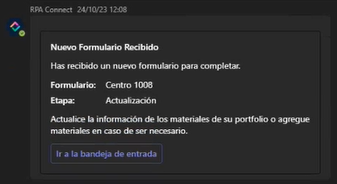

# Actividad en Microsoft Teams

La principal diferencia de Teams respecto del Portal RPA Connect reside en la pestaña _Actividad_, ya que su funcionalidad se centra en las notificaciones que conocimos anteriormente, al abordar la [integración con Microsoft Entra ID](../../administracion/integracion-con-microsoft-entra-id/). Cuando se te asigne una nueva instancia de formulario, la aplicación te enviará una notificación de tipo pop-up y creará un nuevo mensaje de chat en la pestaña _**Actividad**_.

<figure><figcaption>
Notificación en Microsoft Teams
</figcaption></figure>

En esta tarjeta podrás ver:

* El título del formulario, que se establece en función de los datos de la instancia.
* La etapa, si se trata de un workflow, señalando el _**stage**_ actual del proceso.
* Un mensaje personalizado para cada usuario o formulario con un detalle de la acción esperada en dicha solicitud. Para configurarlo, puedes utilizar el parámetro _**notificationMessage**_ al crear acciones con BluePrism, tal como vimos anteriormente para la [función _**Create Stage**_](../../blueprism/conexion-con-blueprism/otras-acciones/acciones-vinculadas-a-stages.md#create-stage).
* Un enlace a la _**Bandeja de Entrada**_, donde podrás consultar la instancia del formulario.

