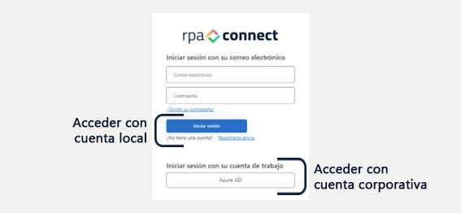
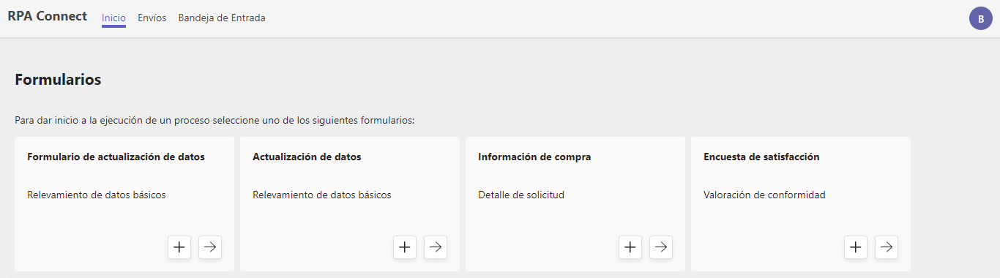

# Características del Portal

Como vimos anteriormente, la aplicación de Teams y el Portal Web guardan una estrecha relación en sus funcionalidades y características, y la decisión respecto a qué plataforma utilizar se encontrará orientada especialmente por las herramientas de trabajo de las que disponga la organización que la utilizará.

Las empresas que tengan cuentas de Microsoft y utilicen Teams como parte de su entorno de trabajo podrán beneficiarse de las notificaciones en la aplicación, mientras que el Portal constituye una opción con mayor flexibilidad, accesible para todo tipo de usuarios.

Una de las principales características del Portal Web es que se aloja en su propia URL ([https://app.rpaconnect.io/portal](https://app.rpaconnect.io/portal)) y cualquier usuario que esté dado de alta podrá registrarse y acceder con su usuario y contraseña utilizando el acceso con cuenta local.

<figure><figcaption>
Inicio de sesión en el Portal RPA Connect
</figcaption></figure>

Esto permitirá que usuarios que no pertenezcan a una organización también puedan acceder a los formularios que le hayan sido asignados y gestionar sus propios envíos.

Dentro del Portal, el entorno de trabajo contará con las mismas pestañas y funcionalidades que abordamos al recorrer Teams, a excepción del apartado de _**Actividad**_ dado que el mismo se encuentra vinculado exclusivamente a las notificaciones de la aplicación.

<figure><figcaption>
Pantalla de Inicio en el Portal RPA Connect
</figcaption></figure>

¡Felicitaciones! Ya sabes cómo utilizar el Portal de RPA Connect y la aplicación de Teams para gestionar tus formularios de un modo más ordenado, rápido y sencillo.

