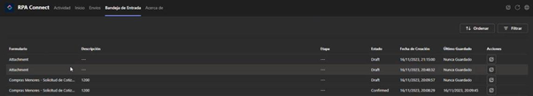
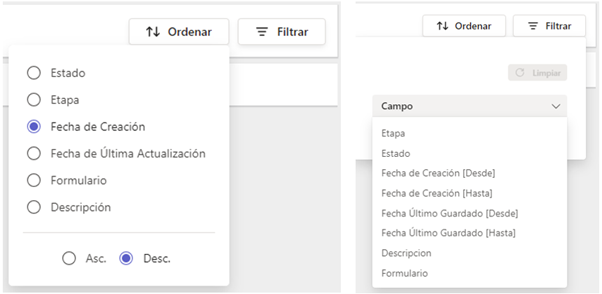
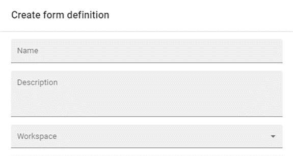

# Bandeja de Entrada

En la pestaña _**Bandeja de Entrada**_, podrás acceder a los envíos automatizados de instancias que hayan sido asignadas a tu usuario. A diferencia de los envíos, en este caso no deberás seleccionar un formulario específico para consultar sus instancias, sino que recibirás todos los envíos que cumplan dichas condiciones. Debido a ello, la _**Bandeja de Entrada**_ funciona también como un historial de los casos recibidos, ya sea que estén respondidos o pendientes de respuesta.

<figure><figcaption>
Pantalla de <em><strong>Bandeja de Entrada</strong></em>
</figcaption></figure>

Al igual que en la pantalla _**Envíos**_, los botones en la esquina superior izquierda te permitirán ordenar y filtrar los formularios según sus datos, con la posibilidad de aplicar múltiples filtros simultáneos. Los filtros para la _**Bandeja de Entrada**_ están predeterminados y no es posible añadir nuevas opciones mediante _**tags**_.

<figure><figcaption>
Opciones de ordenamiento y filtro
</figcaption></figure>

Veamos a continuación cada uno de los datos que nos muestra esta pantalla.

## Formulario

Se refiere al nombre de la plantilla que se haya definido en el campo _**Name**_ de la definición de formulario que veíamos en la sección anterior.

<figure><figcaption>
Campos en la definición de un formulario
</figcaption></figure>

## Descripción

Es el título del formulario, establecido mediante el atributo _**Title**_ en la aplicación _**Build**_. Como vimos anteriormente, puede tratarse tanto de un texto fijo como de uno dinámico que se actualiza en función de los datos ingresados en determinado campo.

## Etapa

Se refiere al _**stage**_ en que se encuentra un formulario dentro de un workflow, es decir, un recorrido con una serie de pasos que deberán responderse de modo ordenado, cada uno compuesto por un formulario. A medida que el usuario avance en el proceso, y si los siguientes _**stages**_ se encuentran asignados al mismo _**manager**_, se irán generando nuevas filas para mostrar cada etapa activa.

## Fecha de creación y Último guardado

Estos datos refieren, respectivamente, a la fecha y hora en que se creó dicha instancia de formulario y a la fecha y hora en que se guardaron los cambios por última vez. Los formularios en estado de borrador pueden presentar la leyenda “Nunca guardado” si aún no se han comenzado a procesar.

## Acciones

La opción de _**Abrir**_ permite ingresar nuevamente al formulario, ya sea que se trate de un envío o de una instancia de borrador.
