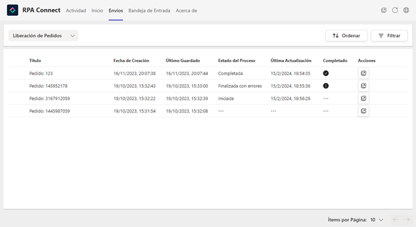
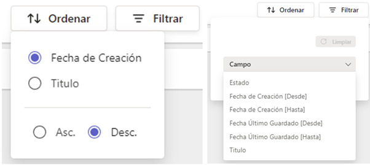
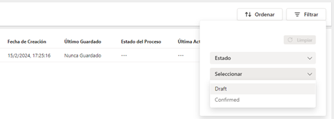
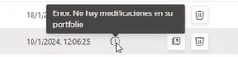
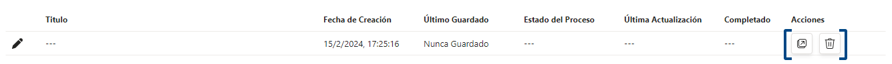

# Envíos

Dependiendo del rol que tengas asignado para cada formulario en _**Authorization profiles**_, en la pestaña _**Envíos**_ podrás ver solamente las instancias que hayas creado (permisos de _**Contributor**_) o bien las de todos los usuarios (permisos de _**Manager**_), incluyendo los borradores de instancias que aún no han enviado.

<figure><figcaption>
Pantalla de <em><strong>Envíos</strong></em>
</figcaption></figure>

En la esquina superior derecha, encontrarás las opciones de ordenamiento y filtro, que te ayudarán a localizar más fácilmente las instancias generadas y organizarlas según resulte necesario.

<figure><figcaption>
Opciones de ordenamiento y filtro
</figcaption></figure>

Los filtros que se aplican sobre los formularios son acumulativos, es decir, puedes utilizar más de uno a la vez. Para ello, despliega el listado, pulsa sobre el primer filtro que desees establecer y selecciona la condición para ese filtro. Por ejemplo, al filtrar por el estado puedes elegir las instancias confirmadas o en borrador.

<figure><figcaption>
Filtro por estado de un formulario
</figcaption></figure>

Una vez que el valor esté establecido, podrás añadir un nuevo filtro pulsando sobre la opción “Agregar filtro” y configurándolo del mismo modo. Se mostrarán las instancias que cumplan con ambas condiciones.

\[VIDEO: FILTRO DE ENVÍOS]

Además de los filtros estándar que se muestran en la imagen, es posible definir otros más específicos y vinculados a los datos y características de cada formulario. Desde la aplicación _**Build**_, pueden configurarse una o más _**tags**_ que hagan referencia a campos de la plantilla y permitan filtrar los envíos en función de los valores ingresados en los mismos.

Por ejemplo, si un formulario tiene un campo denominado “Sucursal” con tres opciones de respuesta, es posible definirlo como _**tag**_ para que, al momento de gestionar los envíos, se encuentre disponible el filtro por sucursal y puedan seleccionarse todas las instancias que se correspondan a cada una de ellas sin necesidad de abrir los envíos individualmente para identificarlas.

A su vez, la pantalla de envíos muestra una serie de datos comunes a todos los formularios que nos permiten identificarlos y conocer su estado. Veamos cada uno de ellos a continuación.

## Título

Es la denominación del formulario, la cual se configura desde la aplicación _**Build**_. El título puede tratarse tanto de una cadena de texto fija como de un componente dinámico que haga referencia a un campo específico.

A excepción de las tablas, que reúnen una serie de propiedades específicas, puedes utilizar cualquier campo como origen para el elemento _**Title**_, tomando como referencia la propiedad _**Name**_. El dato ingresado en dicho campo se mostrará como título para la instancia.

En caso de no haber un título definido, en el listado se mostrará una línea punteada.

## Fecha de creación y Último guardado

Estos datos refieren, respectivamente, a la fecha y hora en que se creó dicha instancia de formulario y a la fecha y hora en que se guardaron los cambios por última vez.

## Estado del proceso

Se trata de un texto libre que puede ingresarse una vez que el formulario haya sido enviado y continuar actualizándose para reflejar la situación en que se encuentra el proceso y dar cuenta de sus avances (en caso de no haber información, se mostrará una línea punteada).

Si bien no existen restricciones respecto a dicho texto, es recomendable establecer ciertos criterios uniformes que faciliten la identificación de la etapa en que se encuentra, por ejemplo:

* _Iniciado:_ formulario enviado en procesamiento.
* _Completado:_ proceso terminado con éxito.
* _Finalizado:_ proceso terminado con error.

La configuración de estos mensajes se realiza a través un conector que se pueda utilizar por la API, tal como vimos anteriormente con BluePrism, [mediante la acción _**Set Form Instance Process Info**_](../../../blueprism/conexion-con-blueprism/otras-acciones/acciones-vinculadas-a-instancias.md#set-form-instance-process-info), dentro del parámetro _**status**_.

## Última Actualización

Este dato indica la fecha y hora del último cambio en el estado de procesamiento de dicho envío, por ejemplo, cuando se ha finalizado. Mientras no se hayan producido actualizaciones y, por tanto, no haya información para mostrar, también aparecerá como una línea punteada.

Al igual que el campo _**Estado del proceso**_, esta información se configura mediante la acción _**Set Form Instance Process Info**_, definiendo los parámetros _**endState**_ y _**completionMessage**_.

<table><thead><tr><th width="199">Parámetro</th><th>Descripción</th></tr></thead><tbody><tr><td><em><strong>endState</strong></em></td><td>Se refiere al estado de procesamiento final con los resultados posibles de “OK” o “Error”, acompañados por los íconos de verificación o alerta.</td></tr><tr><td><em><strong>completionMessage</strong></em></td><td>Es un mensaje de texto libre que acompaña el estado y permite brindar mayores detalles. Es especialmente útil en el caso de errores para informar al usuario los motivos de dicho resultado.</td></tr></tbody></table>

<figure><figcaption>
Mensaje de estado
</figcaption></figure>

## Acciones

El ícono de ventana permite abrir y consultar una instancia guardada o enviada, cualquiera sea su estado, mientras que el ícono de cesto permite descartar un borrador. Ten presente que las instancias enviadas ya no se pueden eliminar.

<figure><figcaption>
Acciones sobre una instancia
</figcaption></figure>
