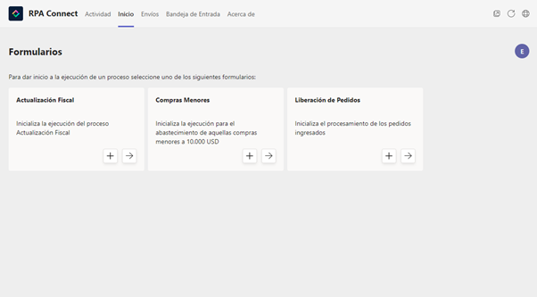
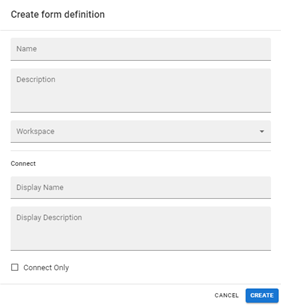
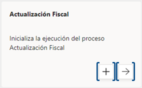
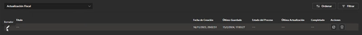
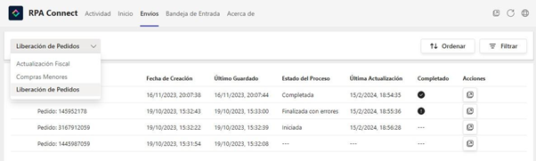

# Inicio

En la pestaña de _**Inicio**_ de Teams podrás ver el listado de formularios que te hayan sido asignados en los roles de _**Contributor**_ o _**Manager**_ a través de la [configuración de _**Authorization Profiles**_](../../../administracion/admin-app/roles-y-permisos.md). Esta primera visualización será la misma para ambos tipos de roles pero, como vimos anteriormente, al momento de gestionar los envíos, los perfiles con permisos de _**Manager**_ podrán visualizar también las instancias enviadas por otros usuarios con acceso a la plantilla.

<figure><figcaption>
Pantalla de <em><strong>Inicio</strong></em>
</figcaption></figure>

Cada tarjeta de formulario tiene un título y una descripción breve, los cuales pueden completarse y editarse [desde la aplicación _**Build**_](../../../diseno-de-formularios/readme/creacion-de-un-formulario.md). Utiliza los campos _**Display Name**_ y _**Display Description**_ en el apartado _**Connect**_ de la definición de formulario para asignarle el nombre o detalle que desees.

<figure><figcaption>
Campos <em><strong>Display Name</strong></em> y <em><strong>Display Description</strong></em>
</figcaption></figure>

Si estos campos no fueron completados en la aplicación _**Build**_, la pantalla Inicio mostrará en su lugar el texto ingresado en los campos _**Name**_ y _**Description**_.

Cada tarjeta cuenta también con dos botones, los cuales refieren a las acciones de crear una nueva instancia y ver el listado de envíos realizados, respectivamente:

<figure><figcaption>
Tarjeta de pantalla <em><strong>Inicio</strong></em>
</figcaption></figure>

Al pulsar en la primera opción, se generará una instancia nueva de formulario para completar y enviar. Los datos que se ingresen en la misma quedarán registrados y guardados como borrador por lo cual, si sales de la instancia y vuelves a crear una, podrás recuperar el progreso realizado. Ten presente que cada usuario puede tener un único borrador por formulario.\

<figure><figcaption>
Borrador de una instancia de formulario
</figcaption></figure>

Desde la segunda opción, podrás acceder al listado de envíos que hayan sido realizados para esa plantilla. También puedes hacerlo seleccionando el formulario que desees en la pestaña _**Envíos**_.

<figure><figcaption>
Envíos de una instancia de formulario
</figcaption></figure>

