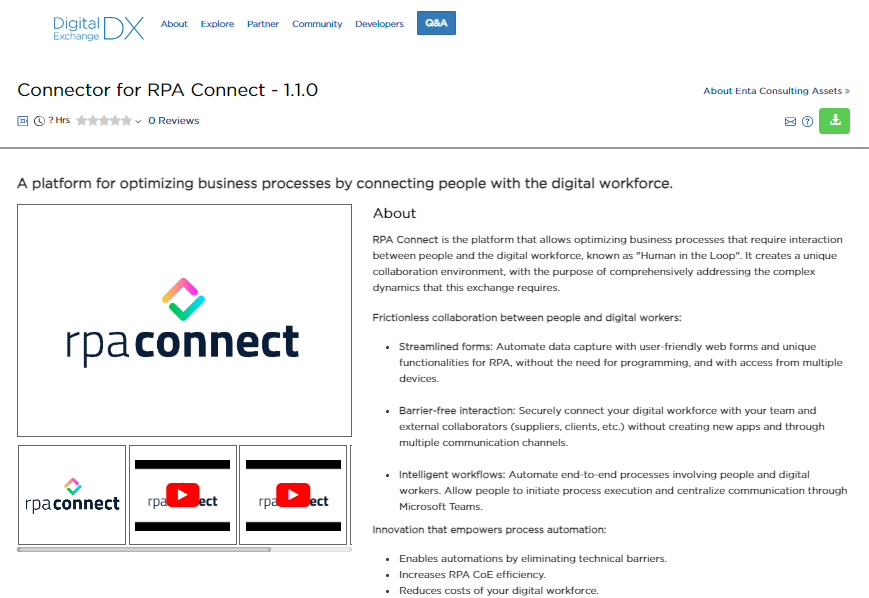
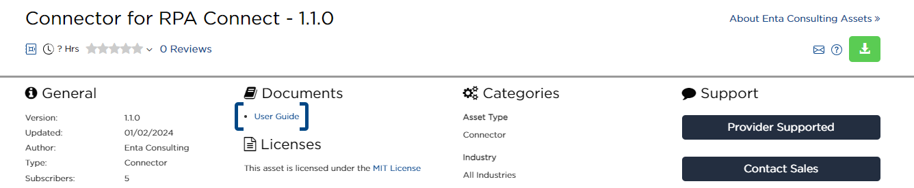

# Conexión con BluePrism

El conector de RPA Connect se encuentra disponible en el portal de DigitalExchange de BluePrism. Puedes acceder desde el siguiente enlace: [https://digitalexchange.blueprism.com/dx/entry/74617/solution/rpa-forms](https://digitalexchange.blueprism.com/dx/entry/74617/solution/rpa-forms)

<figure><figcaption>
Conector para RPA Connect en el portal DigitalExchange
</figcaption></figure>

A continuación, abordaremos los puntos clave de esta herramienta, pero ten presente que puedes acceder a la guía de usuario del conector en el portal de DigitalExchange para un abordaje más detallado.

<figure><figcaption>
Guía de usuario del Conector de RPA Connect
</figcaption></figure>

Cuando finalices el recorrido, tendrás los conocimientos necesarios para:

* Crear una credencial de autenticación para la conexión con BluePrism.
* Generar, consultar y eliminar instancias de formulario.
* Obtener los valores ingresados en un formulario así como consultar y descargar sus archivos adjuntos, entre otras acciones.
