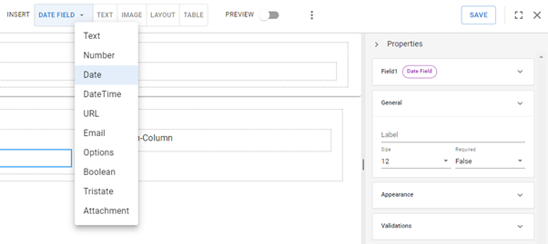
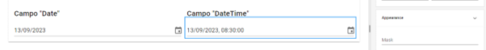

# Campos de fecha y hora

Los elementos _**Date**_ y _**DateTime**_ permiten agregar un calendario donde el usuario seleccionará un día, mes y año (y, en el caso de _**DateTime**_, también una hora). A diferencia de otras opciones para ingresar el mismo tipo de datos (por ejemplo, un campo de texto con máscaras), estas herramientas son especialmente útiles para unificar formatos y evitar errores en la carga de información.&#x20;

## Date

Los campos de fecha pueden utilizarse para ubicar en el tiempo eventos importantes o delimitar plazos. Dado que su función es muy específica, sus opciones de personalización son limitadas y el formato ya estará predefinido.

<figure><figcaption>
Inserción de un campo de tipo <em><strong>Date</strong></em>
</figcaption></figure>

Añadiremos un campo requerido _**Date**_ en la sección de "Datos personales" del formulario para que el usuario pueda escoger su fecha de nacimiento. Para ello, vamos a reorganizar los campos existentes en este apartado, reduciendo el espacio reservado para el DNI y la clave tributaria de modo que aparezcan en la misma fila. Recuerda que deberás dirigirte a _**Properties > General > Size**_ y modificar el tamaño de ambos campos a 6 unidades para que ocupen la mitad del espacio. Se reacomodarán de forma automática, liberando un espacio debajo para que ingresemos el nuevo componente _**Date**_.

Una vez añadido, definiremos el valor “fecha\_nacimiento” para la propiedad _**Name**_ que se registrará internamente y el valor “Fecha de nacimiento” para la propiedad _**Label**_, que visualizará el usuario.

<figure><figcaption>
Definición del campo "Fecha de nacimiento"
</figcaption></figure>

## DateTime

El campo _**DateTime**_ funciona de modo similar, a diferencia de que incorpora un espacio para el horario, útil para establecer agendas de reuniones, detalles de horarios de recepción o entrega y plazos límite más precisos, entre otras posibilidades. El formato de horario también está preestablecido por defecto en horas, minutos y segundos.

<figure><figcaption>
Comparación de los campos <em><strong>Date</strong></em> y <em><strong>DateTime</strong></em>
</figcaption></figure>
