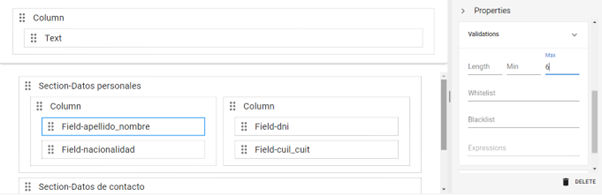
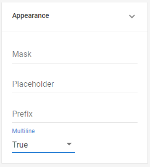
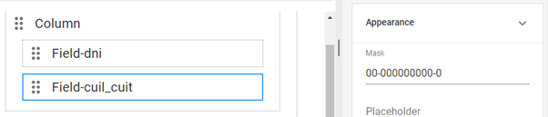
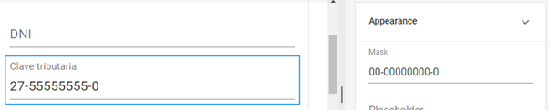
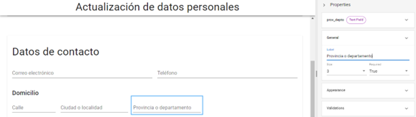
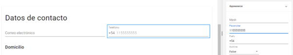

# Campos de texto y numéricos

Los campos más utilizados en la mayoría de los formularios son también los más sencillos de configurar y completar: los campos de número (que solo admiten caracteres del 0 al 9) y los campos de texto (que permiten utilizar también letras y símbolos). Modificando sus propiedades, podemos perfeccionar y adaptar este tipo de campos para usos mucho más precisos.

## Text

Los campos de texto son componentes versátiles y con diversas opciones de configuración. En el formulario diseñado anteriormente, se utilizó el campo de texto en varias instancias: “Apellido y nombre”, “Nacionalidad”, “Clave tributaria” y “Correo electrónico”. Veremos cómo ajustar sus características en función del tipo de dato que esperamos en cada caso.

Para los primeros dos campos no podremos establecer demasiados condicionamientos, ya que no es posible prever qué datos ingresará el usuario, sin embargo podemos estimar que el texto será breve. Dirígete ahora a la sección _**Validations**_ del apartado de propiedades e ingresa el número 60 en el apartado _**Max**_ para establecer el tope máximo de extensión en 60 caracteres.

<figure><figcaption>
Configuración de la propiedad <em><strong>Max</strong></em> para el campo de "Apellido y nombre"
</figcaption></figure>

Si el formulario tuviera un campo para ingresar una descripción o mensaje, sería recomendable configurar un tope de caracteres más alto y permitir varias líneas de texto. Para ello, debes dirigirte a _**Properties > Appearance > Multiline**_ y seleccionar la opción _**False**_.

<figure><figcaption>
Definición de la propiedad <em><strong>Multiline</strong></em>
</figcaption></figure>

Respecto a la clave tributaria, conocemos que en Argentina este dato siempre se compone con el mismo formato: dos números, un guion, ocho números, un guion y un número de control. Puedes definir la propiedad _**Mask**_ para que genere esta estructura automáticamente. Para ello, dirígete al apartado _**Appearance**_ y establece la siguiente configuración:

<figure><figcaption>
Configuración de la propiedad <em><strong>Mask</strong></em> para el campo "Clave tributaria"
</figcaption></figure>

La aplicación interpreta los 0 como caracteres numéricos y da forma a los datos a medida que son ingresados. Puedes probar su funcionamiento activando la previsualización en tiempo real.

<figure><figcaption>
Previsualización del campo "Clave tributaria"
</figcaption></figure>

Por el momento no editaremos el campo “Email”, dado que existen mejores opciones para configurar el tipo de campo para este dato, que veremos más adelante.

Vamos a añadir ahora un nuevo campo de texto. Para ello, inserta una nueva columna dentro de la sección “Datos de contacto” y nómbrala “Domicilio” en la propiedad _**Title**_. Agrega un campo dinámico de texto, que tenga los valores “calle\_dom” para _**Name**_ y “Calle” para _**Label**_ y  dirígete a _**Properties > General > Size**_ para modificar su tamaño a 2 unidades y defínelo como obligatorio (recuerda que debes establecer la propiedad _**Required**_ como _**True**_). En la sección _**Validations**_ del apartado de propiedades, establece el tope máximo de extensión en 60 caracteres.

<figure><figcaption>
Configuración del campo "Calle"
</figcaption></figure>

Crea otros dos campos obligatorios con un tamaño de 3 unidades y tope máximo de extensión en 60 caracteres. Para el primero, indica los valores _**Name**_ y _**Label**_ como “ciud\_loc” y “Ciudad o localidad” respectivamente. Para el segundo, defínelos como “prov\_depto” y “Provincia o departamento”.

<figure><figcaption>
Previsualización del formulario con la sección "Domicilio"
</figcaption></figure>

## Number

Como vimos, los campos numéricos cuentan con una restricción por defecto: solo admiten caracteres del 0 al 9, como los del campo “DNI”. La restricción sobre el tipo de caracter ingresado también aplica a las máscaras ya que forman parte del dato, por ello la estructura con guiones que aplicamos para la clave tributaria utiliza un campo de tipo texto. Los prefijos, en cambio, se añaden por fuera, permitiendo la inclusión de letras o símbolos. Puedes utilizar este campo para definir un código que se mantenga siempre o una característica, en el caso de un número telefónico.

Suponiendo que todos los contactos se produzcan desde Argentina, utiliza el apartado _**Prefix**_ en el campo “Teléfono” de tu formulario, para añadir el código de área +54 de forma predeterminada. En el campo _**Placeholder**_, puedes ingresar un número de muestra para orientar al usuario en el modo en que debe completarlo:

<figure><figcaption>
Configuración de las propiedades <em><strong>Prefix</strong></em> y <em><strong>Placeholder</strong></em>
</figcaption></figure>

En la columna “Domicilio”, añade un campo numérico para la altura de la calle entre los campos de “Calle” y “Ciudad o localidad”. Reduce su tamaño a 1 unidad y defínelo como obligatorio. Luego, indica los valores “num\_calle\_dom” y “Número” para _**Name**_ y _**Label**_ respectivamente y establece el valor máximo del campo en 9999.

A la derecha de ese campo, crearemos otro con las mismas características para el código postal, pero estableciendo el valor “CP” tanto para _**Name**_ como para _**Label**_. Recuerda guardar tu progreso periódicamente para conservar los cambios que realices.

<figure><figcaption>
Configuración de campos numéricos
</figcaption></figure>

