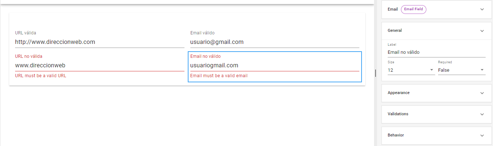
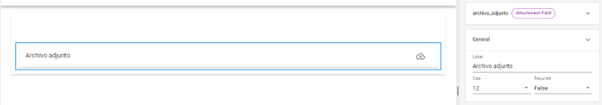

# Otros campos dinámicos

Existen otros campos con una funcionalidad limitada que son utilizados con menos frecuencia en la creación de formularios, como las herramientas _**URL**_ e _**Email**_. Si bien están prediseñadas para recibir y validar este tipo de datos, es posible arribar a los mismos resultados a través de la configuración avanzada de los campos de tipo texto.

<figure><figcaption>
Validación automática de los campos <em><strong>URL</strong></em> e <em><strong>Email</strong></em>
</figcaption></figure>

Otro campo de configuración sencilla y con una función específica es el de _**Attachment**_, que permite al usuario añadir un archivo adjunto en ese espacio del formulario.\

<figure><figcaption>
Propiedades del campo <em><strong>Attachment</strong></em>
</figcaption></figure>
