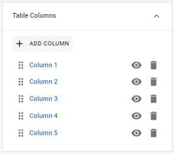

# Tablas

Las tablas son una herramienta de gran funcionalidad y utilidad en la confección de formularios. Además de ofrecer opciones de configuración de permisos y ordenamiento para facilitar tanto la carga como el procesamiento de la información, también permiten adaptar la tipología de sus columnas para restringir y especificar qué tipo de datos serán aceptados en cada caso, al igual que sucede con los campos individuales.

<figure><figcaption>
Selección del elemento de formulario <em><strong>Table</strong></em>
</figcaption></figure>

Como vimos anteriormente, existen herramientas con una serie de propiedades únicas para su tipo. Veamos cada una de las características que puedes determinar al trabajar con tablas:

## Propiedades de tablas

### Table columns

En este apartado podrás crear las columnas que necesites desde el botón _**Add column**_, así como ocultarlas o mostrarlas (ícono con forma de ojo) y también eliminarlas (ícono con forma de cesto). Es importante que en este punto definas qué datos esperas obtener para que la información ingresada esté completa ya que los usuarios no podrán añadir nuevas ni quitar las existentes.

<figure><figcaption>
Apartado <em><strong>Table Columns</strong></em> con las opciones de añadir, ocultar y borrar columnas
</figcaption></figure>

### Validations

Esta propiedad se comporta de un modo similar en todos los campos, aunque en este caso lo que se podrá establecer es el mínimo (por ejemplo, 1) y el máximo (por ejemplo, 10) de filas aceptadas.

<figure><figcaption>
Propiedades de validación para tablas
</figcaption></figure>

### Behavior

Además de las opciones _**Readonly**_ y _**Visibility**_, cuenta con una serie de casillas que puedes tildar para permitir acciones o conceder permisos al usuario. Estas son:

* **Show error markers:** si está activada, habilita que se muestren los indicadores de error cuando los datos ingresados no respetan las validaciones del campo.
* **Can Add:** permite que el usuario añada nuevas filas a la tabla.
* **Can Delete:** permite que el usuario elimine filas.
* **Can Sort:** permite que el usuario ordene las filas de una columna según un valor (por ejemplo, por orden alfabético de los textos).
* **Can Shrink:** permite ajustar el espacio que ocupa la tabla dentro del formulario en función de los datos ingresados.

<figure><figcaption>
Propiedades de comportamiento para tablas
</figcaption></figure>

## Configuración de tablas

Analizaremos en mayor detalle cómo funciona este tipo de elementos incorporando una nueva sección y sumando una tabla de ancho completo. Definiremos como _**Label**_ “Historial de pedidos” y como _**Name**_ “historial\_pedidos”. En el apartado _**Validations**_, define que el número mínimo de filas sea 1 y el máximo 10. En _**Behavior**_, activa las opciones _**Can Add**_**, **_**Can Delete**_ y _**Can Sort**_, para que los usuarios puedan agregar nuevas filas, quitarlas y ordenar los datos ingresados.

<figure><figcaption>
Inserción de tabla
</figcaption></figure>

A continuación, dirígete al apartado _**Table columns**_ y añade 5 columnas. Las utilizaremos para que el usuario pueda ingresar el tipo de producto solicitado, la cantidad de unidades, el código de pedido, la fecha de solicitud y el comprobante.

<figure><figcaption>
Agregado de columnas en una tabla
</figcaption></figure>

Una vez que hayas creado las columnas, haz clic sobre el nombre de la primera para empezar a configurarla. Se abrirá un nuevo panel con las propiedades específicas para esa columna. En primer lugar, define como _**Name**_ “historial\_pedidos\_producto” y en el apartado _**Type**_, elige que el tipo de campo sea _**Options**_, suponiendo que tenemos una cantidad limitada de productos entre las que el usuario puede elegir. Pulsa _OK_ para guardar.  A continuación, establece como _**Label**_ “Producto” y como _**Size**_, 3 unidades.

<figure><figcaption>
Edición de columnas
</figcaption></figure>

En el apartado de opciones, define los valores como “Rojo”, “Verde” y “Azul”. Haz clic en _**Back**_ para volver a las propiedades de la tabla.

<figure><figcaption>
Configuración de opciones en columna de tipo <em><strong>Options</strong></em>
</figcaption></figure>

Selecciona ahora la segunda columna. Define como _**Name**_ “historial\_pedidos\_cantidad” y como tipo de campo, _**Number**_. Su _**Label**_ será “Cantidad” y tendrá un tamaño de 2 unidades. Establece como _**Placeholder**_ “Unidades solicitadas” y como valor máximo 100.

Regresa a las propiedades de la tabla para seleccionar ahora la tercera columna, que llamarás “historial\_pedidos\_codigo” y define que el tipo de campo sea _**Text**_. Su _**Label**_ será “Código de pedido”. Activa la previsualización en tiempo real y haz clic en el signo "+" que se muestra en la parte superior de la tabla para agregar dos filas.

<figure><figcaption>
Agregado de filas en una tabla
</figcaption></figure>

Imaginemos que los códigos están compuestos del siguiente modo, con las primeras dos letras y los primeros tres números siempre invariables: SP ZYR-30032905BC. Es posible reproducir esta estructura a través de las propiedades **Prefix** y **Mask**. Intenta configurar este campo y a continuación prueba ingresando los siguientes códigos:

* **Código correcto:** SP ATI-30058452YT
* **Código incorrecto:** SP RU-8001573PH1

El formulario debería impedir la carga de los datos incorrectos. Comprueba a continuación los parámetros que pueden utilizarse para la validación del código:

<figure><figcaption>
Aplicación de propiedades para estructurar un dato
</figcaption></figure>

Establece el tamaño del campo en 3 unidades y vuelve hacia atrás para seleccionar ahora la cuarta columna. Define para la propiedad _**Name**_ el valor “historial\_pedidos\_fecha”y escoge como tipo de campo _**Date**_. Su _**Label**_ será “Fecha de solicitud” y su tamaño será de 2 unidades.

Por último, dirígete a las propiedades de la tabla y selecciona la última columna, que llamaremos “historial\_pedidos\_comprobante”. Establece como tipo de campo _**Attachment**_, define su _**Label**_ como “Comprobante de pedido” y, dado que ya hemos ocupado 10 de las 12 unidades del ancho total con las columnas restantes, establece su tamaño en 2 unidades.

Una vez que hayas finalizado, tu formulario debería verse como el siguiente:

<figure><figcaption>
Nuevos campos agregados al formulario de "Actualización de datos personales"
</figcaption></figure>

¡Felicitaciones! Has completado con éxito la guía de inicio en RPA Connect. Sigue avanzando en tu recorrido para aprender más sobre las posibilidades de esta herramienta y las configuraciones más complejas que te permitirán potenciar al máximo su usabilidad y eficacia.
