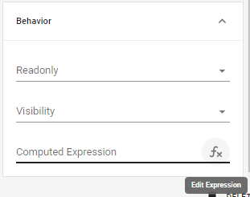
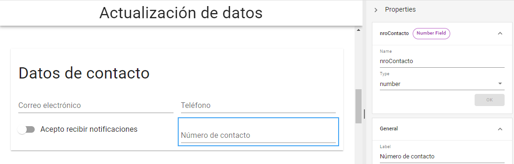
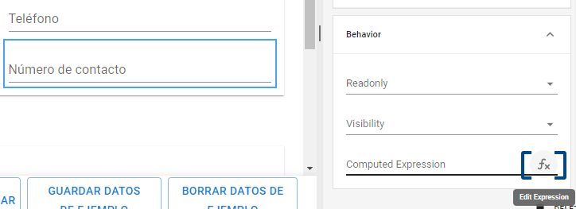
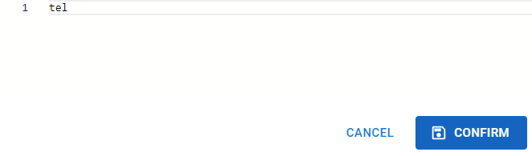
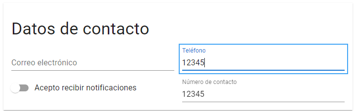
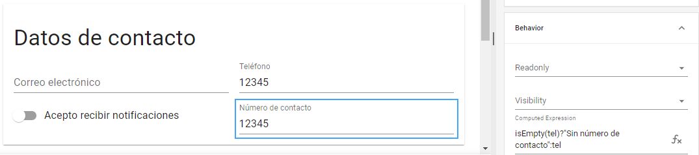
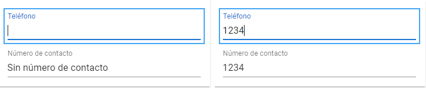

# Comportamientos avanzados

Las _**Computed Expressions**_ permiten cargar información en un campo de modo automático en tanto se cumpla determinada condición. A diferencia de las expresiones de validación, estas funciones no devuelven un valor _**true**_ o _**false**_ acompañado de un mensaje de error, sino que permiten autocompletar determinados campos del formulario según los datos que se hayan ingresado en otro. Estas funciones no se ejecutan constantemente, sino en el momento en que se abre el formulario y cada vez que se detecta un cambio en el campo del que depende la expresión.

<figure><figcaption>
Añadir una expresión en el apartado <em><strong>Behavior</strong></em>
</figcaption></figure>

Es importante recordar que, si la propiedad _**readonly**_ se encuentra definida como _**false**_, el campo automáticamente completado admitirá la modificación por parte del usuario, aunque la nueva información que este ingrese se perderá al producirse un cambio en el campo de referencia y actualizarse el resultado en pantalla. Por el contrario, si _**readonly**_ es definida como _**true**_, el usuario no podrá intervenir sobre los valores de este campo y solo se modificarán cuando se vuelva a ejecutar la expresión.

Veamos un ejemplo de este tipo de expresiones utilizando el campo "Teléfono" del formulario que has creado anteriormente. Añade un nuevo elemento de tipo _**Number**_ con el _**label**_ "Número de contacto" y el nombre "nroContacto".

<figure><figcaption>
Creación de un nuevo campo
</figcaption></figure>

Dirígete al apartado _**Computed Expressions**_ dentro de la sección _**Behavior**_ de ese campo y pulsa el ícono _**fx**_ en en el extremo derecho para abrir el editor.

<figure><figcaption>
Opción <em><strong>Edit Expression</strong></em>
</figcaption></figure>

En este caso, simplemente deberás colocar el nombre del campo con la etiqueta "Teléfono" (en este caso, "tel") y pulsar _**Confirm**_ para que el valor ingresado allí se vea reflejado en el campo "Número de contacto".

<figure><figcaption>
Confirmación de la nueva expresión
</figcaption></figure>

Puedes probar su funcionamiento ingresando datos en el campo "Teléfono" desde el modo _**Preview**_.

<figure><figcaption>
El campo "Número de contacto" reflejará los datos ingresados en el campo "Teléfono"
</figcaption></figure>

Es posible establecer configuraciones más precisas aplicando expresiones de validación a estas funciones. Por ejemplo, podemos utilizar la expresión _**isEmpty()**_ y los operadores ternarios que vimos anteriormente para establecer distintos valores para "Número de contacto" según el campo "Teléfono" esté vacío o completo:

> isEmpty(tel)?"Sin número de contacto":tel

<figure><figcaption>
Expresión isEmpty() dentro de una <em><strong>Computed Expression</strong></em>
</figcaption></figure>

De este modo, si el campo "Teléfono" se encuentra vacío, la primera expresión devolverá _**true**_ y se establecerá como valor del campo el texto que ingresamos antes de los dos puntos ("Sin número de contacto"). Si "Teléfono" tiene datos completos, la expresión devolverá _**false**_ y establecerá como valor del campo el que se encuentra en la última expresión, es decir, el mismo valor ingresado en "Teléfono".

<figure><figcaption>
Comparación del funcionamiento de la validación
</figcaption></figure>

Otra función de gran utilidad de las _**Computed Expressions**_ es la de realizar cálculos entre números ingresados en los campos del formulario. Por ejemplo, teniendo un campo "Cantidad" y un campo "Precio", podemos generar un campo "Total" cuyo contenido esté configurado por una expresión sencilla:

> Precio\*Cantidad

De este modo, obtendremos el total sin necesidad de que el usuario ingrese este dato manualmente.

Partiendo de estos criterios, podrás obtener expresiones más complejas para automatizar tus formularios, por ejemplo, que un campo “Tipo de producto” se configure automáticamente con una expresión que recoja el valor del “Código de producto”, o un campo “País” se autocomplete según el valor de un campo “Provincia”. De este modo, se economizan los tiempos de respuesta y se evitan valores erróneos o incompatibles.

A continuación, veremos los distintos tipos de elementos que puedes añadir en tus formularios y sus características específicas. Ten presente que en muchas ocasiones podrás mejorar su funcionalidad aplicando las expresiones que hemos abordado en este apartado.
