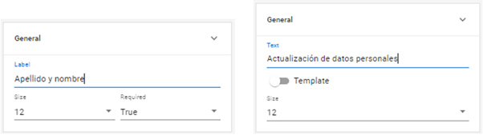

# Propiedades generales

En el apartado _**General**_ se encuentran las propiedades comunes a todos los elementos, que hemos revisado anteriormente. Puedes repasar sus funciones a continuación:

* _**Label:**_ permite establecer el nombre que verá el usuario final al acceder al formulario.
* _**Size:**_ define el ancho del campo. Como vimos anteriormente, la medida por defecto es de 12 unidades que son proporcionales e implican que el campo ocupa el 100% de la columna en la que se encuentra.
* _**Required:**_ establece si es un campo obligatorio _(True)_ o no lo es _(False)_.

Los elementos estáticos como _**Text**_ o _**Image**_ conservan las dos primeras propiedades, pero no pueden configurarse como requeridos dado que este parámetro solo aplica a campos de entrada con los que ingresen datos los usuarios.

<figure><figcaption>
Diferencias entre las propiedades de un campo de entrada y un elemento estático
</figcaption></figure>
