# Validaciones avanzadas

El apartado de _**Validation Expressions**_ permite configurar validaciones de lógica de datos, especialmente eficientes para verificar que el valor ingresado por el usuario en cada campo coincida con el tipo de dato esperado. Su funcionamiento consiste en comprobar el cumplimiento de una condición determinada.

<figure>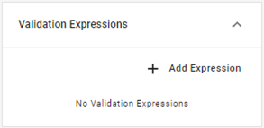<figcaption>
Apartado de <em><strong>Validation Expressions</strong></em>
</figcaption></figure>

Si la condición se cumple y el resultado es verdadero, se muestra un mensaje de error y el usuario no puede enviar dicho formulario hasta que el mismo esté corregido. Si la condición es falsa, no se realizará ninguna acción y el usuario podrá avanzar con el proceso.

Este tipo de validaciones pueden hacer referencia a los datos que se ingresan tanto sobre el campo donde están definidas (por ejemplo, si cumple con una longitud determinada), como en otro campo (mostrar un error en el campo “Cantidad” si el campo “Producto” no es válido) o comparando los datos entre dos campos (si la fecha de inicio ingresada para determinado período es posterior a la fecha de finalización).

<figure>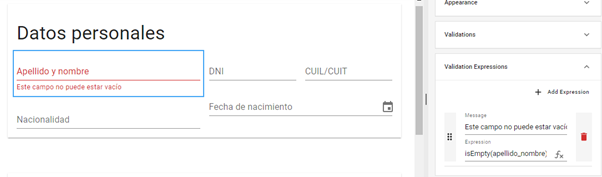<figcaption>
Ejemplo de mensaje de error al validarse la expresión ingresada
</figcaption></figure>

Cada expresión se compone de dos valores:

<table><thead><tr><th width="131">Valor</th><th>Descripción</th></tr></thead><tbody><tr><td>Mensaje</td><td>Es el texto que se desea mostrar al usuario para advertir el error cuando se cumple la condición validada y no es posible enviar el formulario</td></tr><tr><td>Expresión</td><td>Fórmula asociada que ejecutará la validación por cual se muestra el mensaje</td></tr></tbody></table>

<figure>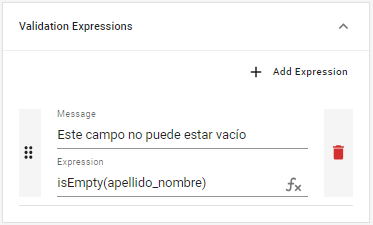<figcaption>
Detalle de mensaje y expresión
</figcaption></figure>

La opción _**Add Expression**_ en el extremo superior derecho del apartado te permitirá incluir funciones adicionales, habilitando nuevos campos para mensajes y expresiones. Esto resulta de utilidad para validar el cumplimiento de varias condiciones dentro de un mismo campo, por ejemplo, que una fecha se encuentre dentro de determinado periodo, que sea más reciente que la fecha de otro campo y distinta de la de un tercero. Aplicar múltiples fórmulas con criterios específicos te permitirá tener un control más preciso respecto al tipo de datos admitidos, ayudando a reducir el margen de error.

<figure>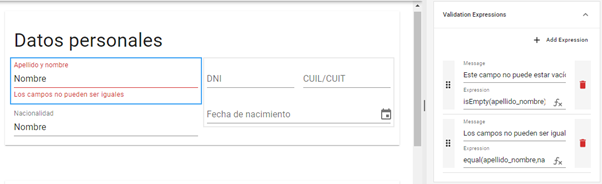<figcaption>
Configuración de múltiples expresiones para un mismo campo con <em><strong>Add Expression</strong></em>
</figcaption></figure>

A continuación, analizaremos en detalle las siguientes expresiones:

<table><thead><tr><th width="273">Función</th><th width="187">Tipo de validación</th><th>Resultado</th></tr></thead><tbody><tr><td>isEmpty(Campo)</td><td>Validación de contenido</td><td>Devuelve <em><strong>true</strong></em> (mensaje de error) si un campo se encuentra vacío</td></tr><tr><td>count(Tabla)==0</td><td>Validación de contenido</td><td>Devuelve <em><strong>true</strong></em> si las filas de una tabla están vacías</td></tr><tr><td>sum(Tabla,Columna)!=N</td><td>Validación de contenido</td><td>Devuelve <em><strong>true</strong></em> si el total de una columna es distinto al permitido</td></tr><tr><td>dateDifferenceInBusinessDays(Fecha1,Fecha2)&#x3C;=N</td><td>Validación de contenido</td><td>Devuelve <em><strong>true</strong></em> si el número de días de lunes a viernes es menor al permitido por la regla</td></tr><tr><td>equal(Campo1,Campo2)</td><td>Validación de comparación</td><td>Devuelve <em><strong>true</strong></em> si dos campos presenten el mismo valor</td></tr><tr><td>smaller(Fecha1,Fecha2)</td><td>Validación de comparación</td><td>Devuelve <em><strong>true</strong></em> si la primer fecha es menor a la segunda</td></tr><tr><td>larger(Fecha1,Fecha2)</td><td>Validación de comparación</td><td>Devuelve <em><strong>true</strong></em> si la primer fecha es mayor a la segunda</td></tr><tr><td>smallerEq(Fecha1,Fecha2)</td><td>Validación de comparación</td><td>Devuelve <em><strong>true</strong></em> si la primer fecha es menor o igual a la segunda</td></tr><tr><td>largerEq(Fecha1,Fecha2)</td><td>Validación de comparación</td><td>Devuelve <em><strong>true</strong></em> si la primer fecha es mayor o igual a la segunda</td></tr><tr><td>not(Campo)</td><td>Validación de operadores lógicos</td><td>Devuelve <em><strong>true</strong></em> si el campo tiene resultado negativo</td></tr><tr><td>not(Expresión)</td><td>Validación de operadores lógicos</td><td>Devuelve <em><strong>true</strong></em> si la expresión tiene resultado negativo</td></tr><tr><td>and(Expresión1,Expresión2)</td><td>Validación de operadores lógicos</td><td>Devuelve <em><strong>true</strong></em> si se cumplen las dos expresiones</td></tr><tr><td>or(Expresión1,Expresión2)</td><td>Validación de operadores lógicos</td><td>Devuelve <em><strong>true</strong></em> si se cumple una de las dos expresiones</td></tr><tr><td>ExpresiónCondicional?ExpresiónCondiciónVerdadera:ExpresiónCondiciónFalsa</td><td>Validación con operador ternario</td><td>Devuelve el resultado de una segunda expresión dependiente del cumplimiento de la primera</td></tr></tbody></table>

Ten presente que los componentes de una fórmula se incluyen entre paréntesis. El editor te mostrará un aviso de error en caso de que el número de paréntesis abiertos en la fórmula no coincida con el número de paréntesis cerrados, ayudándote a encontrar incoherencias en funciones más complejas.

<figure>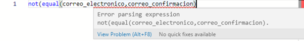<figcaption>
Alerta por un error en la estructura de la expresión
</figcaption></figure>

## Validaciones de contenido

Existen ciertas fórmulas que nos permitirán evaluar la validez de un dato en función del cumplimiento de ciertas características en los valores ingresados frente a una norma establecida para dicho campo: por ejemplo, que no pueda estar en blanco o que no exceda ciertos límites. Veamos algunos de ellos y su funcionamiento a continuación.

### Validación de campos en blanco

Como vimos anteriormente, las expresiones de validación nos permiten aplicar mejoras a ciertas funcionalidades de nuestro formulario, como es el caso de la configuración de formularios requeridos. A continuación, haremos uso de la expresión _**isEmpty()**_ para definir un campo como obligatorio y mostrar un mensaje de error personalizado cuando el usuario intenta enviarlo en blanco.

Selecciona el campo "Apellido y nombre" y establece la propiedad _**Required**_ como _**False**_ para deshabilitarla. Luego, dirígete al apartado _**Validation Expressions**_.

<figure>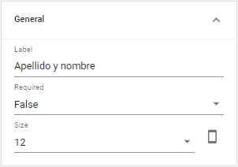<figcaption>
Modificación de la propiedad <em><strong>Required</strong></em>
</figcaption></figure>

En el campo _**Message**_, escribe la leyenda que se mostrará al usuario si no completa dicho campo, por ejemplo: "Debes ingresar tu nombre y apellido".

A continuación, deberás establecer la fórmula que controle dicha condición. Pulsa el ícono _**fx**_ en en el extremo derecho del campo _**Expression**_ para abrir el editor e ingresa la fórmula:

> isEmpty(apellido\_nombre)

<figure>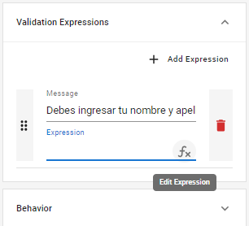<figcaption>
Opción <em><strong>Edit Expression</strong></em>
</figcaption></figure>

Siempre que añadas una expresión, asegúrate de comprobar que los nombres de los campos se encuentren escritos correctamente, respetando las mayúsculas y minúsculas. El editor mostrará un aviso informando que un nombre de campo no está presente en el esquema si se ingresa un valor no declarado, pero no podrá detectar si has escrito el nombre de otro campo existente en su lugar.

Una vez que hayas añadido la expresión, pulsa _**Confirm**_ para terminar. Si la condición se cumple, es decir, si el campo "Apellido y nombre" está en blanco, la función devolverá el valor _**true**_ y mostrará el mensaje "Debes ingresar tu nombre y apellido", de modo que el usuario no podrá enviar el formulario hasta tanto haya ingresado este dato. Por el contrario, si la condición no se cumple porque el campo está completo, devolverá el valor _**false**_ y el usuario podrá enviar el formulario correctamente.



Este tipo de validación también puede aplicarse a tablas, para corroborar si existen filas cargadas en la misma, o a campos de tipo _**Attachment**_, comprobando si se ha añadido un archivo adjunto. En caso de no haber información, la fórmula devolverá el valor _**true**_ y mostrará un mensaje de error.

<figure>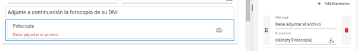<figcaption>
Aplicación de la función <em><strong>isEmpty()</strong></em> a un campo de tipo <em><strong>Attachment</strong></em>
</figcaption></figure>

### Validación de campos en blanco en una tabla

La fórmula _**count()**_ resulta útil para contar la cantidad de caracteres ingresados en un campo y, aplicada a una tabla, permite contar la cantidad de filas completas. Para construir una expresión de validación a partir de esta función, es posible añadir un operador para que la comprobación devuelva error en caso de que el total sea igual a cero.

> count(Tabla)==0

<figure>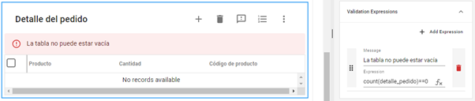<figcaption>
Validación de contenido en una tabla
</figcaption></figure>

También pueden utilizarse otros operadores sencillos para validar que dicha cantidad se encuentre dentro de los límites permitidos:

<table><thead><tr><th width="123">Operador</th><th width="184">Ejemplo</th><th>Validación</th></tr></thead><tbody><tr><td>==</td><td>count(Tabla)==0</td><td>Devuelve <em><strong>true</strong></em> (error) si el total es igual a cero</td></tr><tr><td>!=</td><td>count(Tabla)!=100</td><td>Devuelve <em><strong>true</strong></em> si el total es distinto a 100</td></tr><tr><td>></td><td>count(Tabla)>100</td><td>Devuelve <em><strong>true</strong></em> si el total es mayor a 100</td></tr><tr><td>&#x3C;</td><td>count(Tabla)&#x3C;10</td><td>Devuelve <em><strong>true</strong></em> si el total es menor a 10</td></tr></tbody></table>

### Validación de totales de una columna en una tabla

La función _**sum()**_ suma todos los números dentro del rango de una columna para contabilizar un total. Añadiendo operadores a esta función, es posible convertirla en una expresión de validación que compare el total frente a un número prestablecido y devuelva un error cuando el dato ingresado no coincide con lo esperado. Por ejemplo, en una tabla de ventas donde la columna "porcentaje" reúne la porción de ingresos sobre el total para cada tipo de producto, la suma de cada celda debe dar como resultado un total de 100.

La siguiente función permitirá detectar si el total es diferente a 100 y mostrar un mensaje de error si esta condición se cumple:

> sum(TablaVentas,ColumnaPorcentaje)!=100

### Validación de días de lunes a viernes entre dos fechas

Con la función _**dateDifferenceInBusinessDays()**_ se calculan el total de días de lunes a viernes entre dos fechas. Al igual que en _**count()**_, añadiendo un operador al cálculo es posible contrastarlo contra un mínimo o máximo estipulado. Por ejemplo:

> dateDifferenceInBusinessDays(FechaSolicitud,FechaEntrega)<=5

Esta fórmula contabilizará los días entre la fecha de solicitud y la de entrega, descontando los fines de semana, y mostrará un mensaje de error si la condición es verdadera, es decir, si el periodo transcurrido entre ambas fechas es inferior o igual a 5 días.

<figure>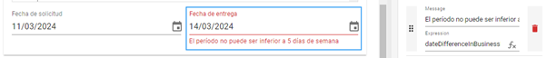<figcaption>
Validación de periodo transcurrido entre dos fechas
</figcaption></figure>

## Validación de comparación entre campos

Otras expresiones de gran utilidad son aquellas que permiten comparar los datos ingresados en distintos campos, en término de similitud o diferencia entre sus valores.

### Validación de valores idénticos

La función _**equal()**_ controla ambos valores (ya sean textos, números o fechas) y devuelve _**true**_ si son iguales, mostrando un mensaje de error e impidiendo el envío de la instancia.

Tomando como base el formulario que has diseño, crea un nuevo campo de tipo _**Number**_ con el _**label**_ "Teléfono móvil" y el nombre "tel\_movil" en la sección "Datos de contacto".

Para comprobar que el número ingresado en este campo sea distinto al ingresado en el campo "Teléfono" podemos recurrir a esta expresión de validación. Pulsa el ícono _**fx**_ en en el extremo derecho del campo _**Expression**_ y escribe la fórmula:

> equal(tel,tel\_movil)

A continuación, presiona _**Confirm**_. Si esta condición se cumple, se mostrará una alerta, la cual definiremos en el campo _**Message**_, por ejemplo: "El número del teléfono de línea y del teléfono móvil no pueden ser el mismo".

<figure>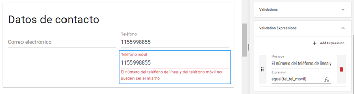<figcaption></figcaption></figure>

Es posible construir una alternativa más sencilla a esta función utilizando operadores para realizar la comparación. Por ejemplo, si reemplazas la fórmula _**equal()**_ del ejemplo anterior por la expresión _**tel==tel\_movil**_, se realizará la misma validación y obtendrás los mismos resultados.

<figure>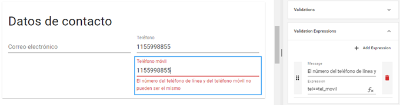<figcaption>
Alternativa a la expresión <em><strong>equal()</strong></em> con operadores
</figcaption></figure>

Veamos los distintos tipos de operadores que puedes utilizar para comparar los datos de dos campos, así como un ejemplo de cada uno y la acción&#x20;

<table><thead><tr><th width="123">Operador</th><th width="184">Expresión</th><th width="242">Ejemplo</th><th>Validación</th></tr></thead><tbody><tr><td>==</td><td>Campo1==Campo2</td><td>Nombre==Apellido</td><td>Comprueba si los campos son iguales</td></tr><tr><td>!=</td><td>Campo1!=Campo2</td><td>Email!=ConfirmarEmail</td><td>Comprueba si los campos son distintos</td></tr><tr><td>></td><td>Campo1>Campo2</td><td>Unidades_vendidas>Stock</td><td>Comprueba si el primer campo es mayor que el segundo</td></tr><tr><td>&#x3C;</td><td>Campo1&#x3C;Campo2</td><td>Cantidad&#x3C;CantidadMinima</td><td>Comprueba si el primer campo es menor que el segundo</td></tr></tbody></table>

También puedes combinar los operadores _mayor que_ (**>**) y _menor que_ (**<**) con el operador _igual_ (**=**) para un resultado más específico, por ejemplo: _**CantidadRecomendada>=CantidadMaxima**_. En todos estos casos, el cumplimiento de la condición devolverá el valor _**true**_ y mostrará el mensaje de error que se haya ingresado en la propiedad _**Message**_.

### Validación de fechas

La función _**smaller()**_ permite comparar las fechas ingresadas en dos campos y devolver un mensaje de error si la primera es menor a la segunda, por ejemplo "La fecha de finalización no puede ser menor a la fecha de inicio". Su estructura se plantea del siguiente modo:

> smaller(FechaInicio,FechaFin)

<figure>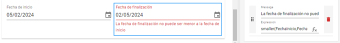<figcaption>
Comparación entre fechas con la función <em><strong>smaller()</strong></em>
</figcaption></figure>

Por el contrario, la función _**larger()**_ evalúa si la primera fecha es mayor a la segunda y devuelve un mensaje de error en caso de cumplirse esta condición. Su estructura se muestra a continuación:

> larger(FechaFin,FechaInicio)

<figure>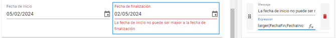<figcaption>
Comparación entre fechas con la función <em><strong>larger()</strong></em>
</figcaption></figure>

Existen variaciones para ambas expresiones contemplando que la función devuelva un mensaje de error también en caso de que ambas fechas sean idénticas, es decir, aplicando la funcionalidad de _**equal()**_. Para ello deberemos modificar los argumentos de dichas funciones por:

* _**smallerEq (Fecha1,Fecha2)**_: comprobará que la primera fecha sea menor o igual a la segunda
* _**largerEq (Fecha1,Fecha2)**_: comprobará que la primera fecha sea mayor o igual a la segunda

<figure>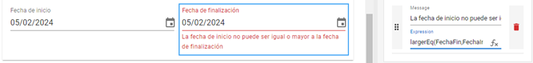<figcaption>
Aplicación de la expresión <em><strong>largerEq()</strong></em>
</figcaption></figure>

Estas funciones también pueden utilizarse para comparar otro tipo de valores, como números o cadenas de texto.

## Validación de operadores lógicos

Las expresiones basadas en operadores _**AND**_, _**OR**_ y _**NOT**_ permiten realizar validaciones según el cumplimiento de ciertas condiciones _verdadero/falso_ ya sea en el valor de un campo o expresión (en el caso de _**NOT**_) o en el resultado entre dos expresiones aplicadas a un campo (_**AND**_ y _**OR**_). Veamos en detalle cada una de estas validaciones lógicas.

### Operador NOT

La función _**not()**_ devuelve _**true**_ si el campo tiene un valor negativo y habitualmente se utiliza para campos booleanos, que funcionan como un botón que puede activarse o dejarse desactivado según una lógica binaria _sí/no_. Más adelante veremos en detalle [este tipo de campo](../../desarrollo-integral-de-un-formulario/campos-de-seleccion-de-opciones.md).

Si el booleano está desactivado, es decir, si la respuesta es negativa, la expresión devolverá un mensaje de error. Puede aplicarse, por ejemplo, a un campo booleano de nombre "Confirmación" que muestre un mensaje de error con el mensaje "Debe aceptar los términos y condiciones para continuar" si se devuelve un resultado _**true**_ a la siguiente expresión:

> not(Confirmacion)

<figure>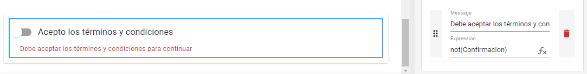<figcaption>
Validación de un campo booleano
</figcaption></figure>

También es posible hacer validaciones más complejas aplicando la expresión _**not()**_ a la comprobación de otras funciones, por ejemplo:

> not(equal(Campo1,Campo2))

Si no se cumple la condición de que los campos 1 y 2 sean iguales, se mostrará un mensaje de error. Recuerda que el editor te mostrará un aviso de error en caso de que el número de paréntesis abiertos en la fórmula no coincida con el número de paréntesis cerrados.

<figure>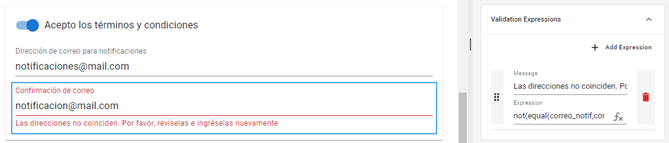<figcaption>
Comprobación de diferencia entre valores
</figcaption></figure>

### Operador AND

Con la expresión _**and()**_ es posible comprobar el cumplimiento simultáneo de dos expresiones distintas y mostrar un mensaje de error cuando esto ocurre (es decir, cuando ambas devuelven _**true**_), utilizando la siguiente comprobación lógica:

<table><thead><tr><th width="207">Resultado Expresión1</th><th width="192">Resultado Expresión2</th><th>Resultado de and(Expresión1,Expresión2)</th></tr></thead><tbody><tr><td>false</td><td>false</td><td>false</td></tr><tr><td>true</td><td>false</td><td>false</td></tr><tr><td>false</td><td>true</td><td>false</td></tr><tr><td>true</td><td>true</td><td>true</td></tr></tbody></table>

Por ejemplo, si tenemos un formulario con dos campos booleanos de los cuales al menos uno debe estar activado, como la solicitud de recibir un comprobante físico o un comprobante virtual, puede aplicarse la función _**and()**_ para mostrar un error en caso de que ambos casilleros estén desactivados.

> and(not(ComprobanteFisico),not(ComprobanteVirtual))



Analicemos el funcionamiento de dicha expresión:

<table><thead><tr><th width="212">Resultado Expresión1</th><th width="194">Resultado Expresión2</th><th>Resultado de and(Expresión1,Expresión2)</th></tr></thead><tbody><tr><td>false: El usuario ha solicitado recibir un comprobante físico</td><td>false: El usuario ha solicitado recibir un comprobante virtual</td><td>false: No se muestra mensaje de error, dado que ninguna condición se cumple</td></tr><tr><td>true: El usuario no ha solicitado recibir un comprobante físico</td><td>false: El usuario ha solicitado recibir un comprobante virtual</td><td>false: No se muestra mensaje de error, dado que se cumple solo una condición</td></tr><tr><td>false: El usuario ha solicitado recibir un comprobante físico</td><td>true: El usuario no ha solicitado recibir un comprobante virtual</td><td>false: No se muestra mensaje de error, dado que se cumple solo una condición</td></tr><tr><td>true: El usuario no ha solicitado recibir un comprobante físico</td><td>true: El usuario no ha solicitado recibir un comprobante virtual</td><td>true: Se muestra el mensaje de error porque se cumplen ambas condiciones</td></tr></tbody></table>

Es posible construir estructuras más complejas para este tipo de validación anidando otras fórmulas con el operador _**AND**_ dentro de la función del campo para controlar un mayor número de expresiones:

> and(Expresión1,and(Expresión1,Expresión2))

De este modo la comprobación de la expresión 1 devolverá un valor _**true**_ o _**false**_ que se comparará. con el valor total _**true**_ o _**false**_ que devuelva la segunda función _**and()**_ al controlar las expresiones 2 y 3. Estas funciones pueden seguir anidándose siempre que se respete la misma estructura.

### Operador OR

La expresión _**or()**_ permite verificar que se cumpla al menos una de dos expresiones y mostrar un mensaje de error a excepción de que ambas devuelvan _**false**_, utilizando esta comprobación lógica:

<table><thead><tr><th width="202">Resultado Expresión1</th><th width="199">Resultado Expresión2</th><th>Resultado de and(Expresión1,Expresión2)</th></tr></thead><tbody><tr><td>false</td><td>false</td><td>false</td></tr><tr><td>true</td><td>false</td><td>true</td></tr><tr><td>false</td><td>true</td><td>true</td></tr><tr><td>true</td><td>true</td><td>true</td></tr></tbody></table>

Por ejemplo, si el envío del formulario requiere que el usuario ingrese su correo electrónico en un campo de texto "Email" y también acepte recibir notificaciones al mismo activando un campo booleano "Recibir notificaciones", es posible utilizar la siguiente función:

> or(isEmpty(correo\_electronico),not(Notificaciones))



Analicemos el funcionamiento de dicha expresión, configurando un mensaje de error "Debe ingresar su casilla de email y aceptar recibir notificaciones" si se demuestra verdadera:

<table><thead><tr><th width="210">Resultado expresión 1</th><th width="202">Resultado expresión 2</th><th>Resultado de or(expresion1,expresion2)</th></tr></thead><tbody><tr><td>false: El campo "Email" está completo</td><td>false: La casilla "Recibir notificaciones" está activada</td><td>false: No se muestra mensaje de error, dado que ninguna condición se cumple</td></tr><tr><td>true: El campo "Email" está vacío</td><td>false: La casilla "Recibir notificaciones" está activada</td><td>true: Se muestra el mensaje de error porque se cumple una de las condiciones</td></tr><tr><td>false: El campo Email está completo</td><td>true: La casilla "Recibir notificaciones" está desactivada</td><td>true: Se muestra el mensaje de error porque se cumple una de las condiciones</td></tr><tr><td>true: El campo "Email" está vacío</td><td>true: La casilla "Recibir notificaciones" está desactivada</td><td>true: Se muestra el mensaje de error porque se cumplen ambas condiciones</td></tr></tbody></table>

Al igual que las funciones con el operador _**AND**_, es posible anidar otras fórmulas del tipo _**or()**_ dentro de una sola expresión para realizar una comprobación de múltiples condiciones _**true**_ o _**false**_, por ejemplo:

> or(Expresión1,or(Expresión1,Expresión2))

## Validación con operador ternario

Este tipo de validaciones se compone de tres expresiones:

* Una expresión condicional, cuyo cumplimiento o no devolverá la evaluación de una u otra expresión dependiente
* Una expresión si la condición es verdadera
* Una expresión si la condición es falsa

Las mismas se estructuran del siguiente modo, donde el símbolo _**?**_ marcará el inicio de la expresión que se devolverá si la condición es verdadera y _**:**_ marcará el inicio de la expresión que se devolverá si la condición es falsa:

> ExpresiónCondicional?ExpresiónCondiciónVerdadera:ExpresiónCondiciónFalsa

Veamos un ejemplo y su funcionamiento:

> isEmpty(FechaInicio)?not(Pendiente):smaller(FechaFin,FechaInicio)

* La primera validación comprobará si el campo FechaInicio se encuentra vacío.
* Si el resultado de la primera condición es verdadero, la segunda expresión comprobará si la casilla "Pendiente" está desactivada.
* Si es verdadero, devolverá un mensaje de error ("La fecha de inicio debe estar completa y ser anterior a la fecha de finalización").

<figure>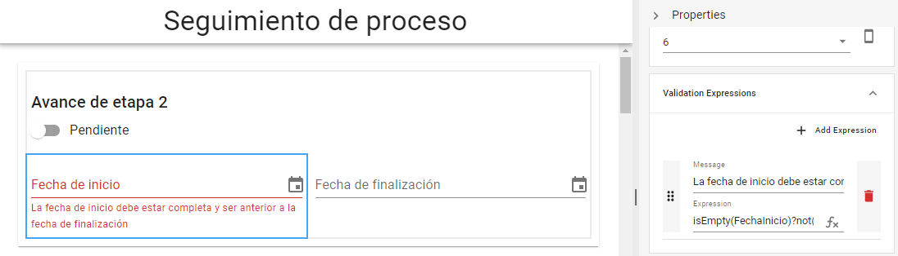<figcaption>
Mensaje de error al comprobarse una condición verdadera
</figcaption></figure>

* Si es falso, no realizará ninguna acción dado que el proceso está pendiente y por ello no se ha ingresado una fecha.

<figure>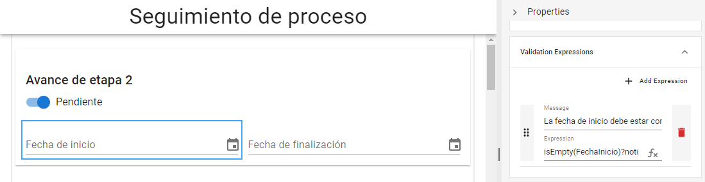<figcaption>
Comprobación de condición falsa
</figcaption></figure>

* Si el resultado de la primera condición es falso, la tercer expresión comprobará que la fecha de finalización sea menor a la fecha de inicio. Si es verdadero, devolverá el mensaje de error.

<figure>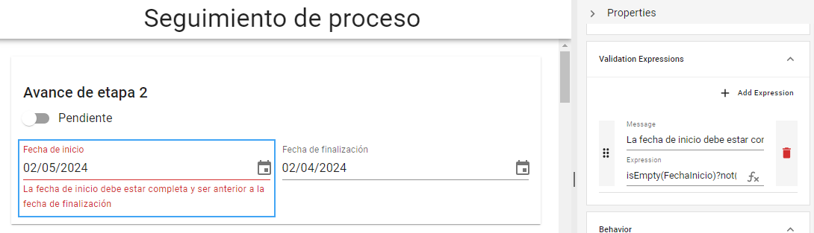<figcaption>
Mensaje de error ante comprobación de datos inválidos
</figcaption></figure>

* Si es falso, no realizará ninguna acción ya que las fechas son válidas.

<figure>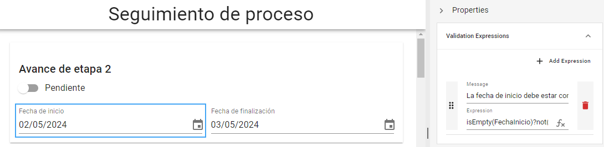<figcaption>
Comprobación de validez en los datos ingresados
</figcaption></figure>

