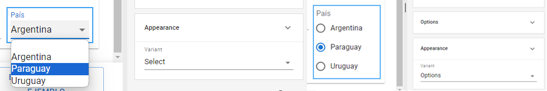
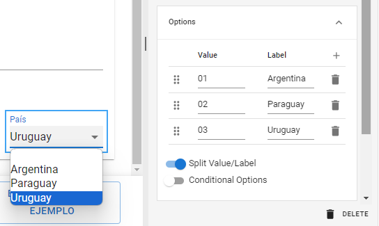
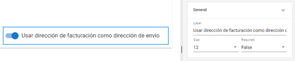
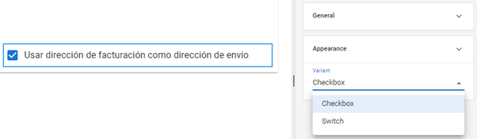
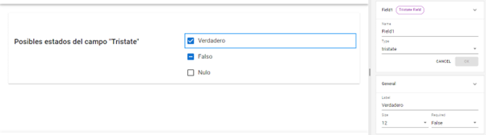

# Campos de selección de opciones

Como vimos anteriormente, existen ciertos componentes que, debido a su funcionalidad, presentan una serie de propiedades específicas para su tipo. Este es el caso de los campos que permiten establecer opciones predefinidas _**Options**_, _**Boolean**_ y _**Tristate**_.

## Options

La herramienta _**Options**_ permite generar una lista de valores predefinidos entre los cuales el usuario realizará una selección. Vamos a analizar su funcionamiento incluyendo un campo de este tipo en el apartado de “Domicilio”. Al lado del campo “Provincia o departamento”, ubica un nuevo campo requerido con el nombre “pais”, define como _**Label**_ “País” y reduce su tamaño a 2 unidades. No olvides guardar los cambios a medida que avanzas en el diseño de tu formulario.


Inserción de campo "Options"


Dentro de la sección _**Properties**_, dirígete al apartado _**Options**_ y haz clic sobre el botón con el signo "+" junto a la descripción _**Value**_. Se sumará un nuevo valor “Option 1”. Puedes repetir este paso tantas veces como lo necesites, en este caso añadiremos tres opciones: Argentina, Paraguay y Uruguay. Si quieres eliminar una opción, haz clic en el icono del cesto que aparece justo a su derecha.


Configuración de opciones para el campo "País"


Puedes elegir distintas variantes para mostrarla desde el apartado de **Properties > Appearance**, las principales son:&#x20;

* **Select:** muestra las opciones en una lista desplegable.
* **Options:** muestra todas las opciones en pantalla con un formato de botón de radio.

Es recomendable que al momento de escoger el formato que más se adapte a tu formulario, actives la previsualización en tiempo real y compruebes su funcionamiento.

<figure><figcaption>
Comparación de las variantes <em><strong>Select</strong></em> y <em><strong>Options</strong></em> en el apartado de propiedades <em><strong>Appearance</strong></em>
</figcaption></figure>

La opción _**Split Value/Label**_ permite asignar a cada opción un valor real distinto del que se muestra al usuario. Esto ayuda a simplificar el procesamiento de los datos, por ejemplo, si cada país tuviese un código interno asignado, mostraremos los nombres de los países en _**Label**_ e ingresaremos el código correspondiente a cada uno en _**Value**_.

<figure><figcaption>
Configuración de la función <em><strong>Split Value/Label</strong></em>
</figcaption></figure>

## Boolean

A diferencia de _**Options**_, el campo booleano permite establecer un valor de lógica binaria _sí/no_ donde el usuario pueda definir si una condición es verdadera o no, activando o desactivando el botón. Este campo mantiene las propiedades generales comunes a los campos dinámicos y el valor a evaluar se define en la propiedad _**Label**_.

<figure><figcaption>
Definición de un campo de tipo <em><strong>Boolean</strong></em>
</figcaption></figure>

Este tipo de herramienta puede utilizarse para informar un estado, marcar el cumplimiento de ciertas características, decidir la preferencia de un servicio adicional, etc. Dentro de _**Appearance**_, es posible elegir entre las variantes _**Switch**_, que mostrará un deslizable como el del ejemplo, y _**Checkbox**_, que mostrará una casilla de opción.

<figure><figcaption>
Apariencia alternativa de <em><strong>Boolean</strong></em> con el formato <em><strong>Checkbox</strong></em>
</figcaption></figure>

## Tristate

Los campos de este tipo generan un botón con tres estados posibles: verdadero, falso y nulo (sin respuesta). Debido a su sencillez, las opciones de configuración de _**Tristate**_ se limitan a propiedades generales como las de _**Boolean**_, aunque se diferencia de este campo por la posibilidad de mantener una respuesta neutral sin que el usuario deba escoger obligatoriamente un valor positivo o uno negativo prestablecido.

<figure><figcaption>
Propiedades del campo <em><strong>Tristate</strong></em>
</figcaption></figure>
