# Diseño de un formulario básico

## Layout

Los formularios se maquetan sobre una estructura de secciones, compuestas a su vez por columnas en las que se añaden los distintos tipos de campos de datos.

Para añadir nuevas secciones o columnas, es necesario dirigirse a la cinta de herramientas y pulsar sobre la opción _**Layout**_.

<figure>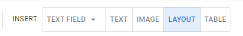<figcaption>
Opción <em><strong>Layout</strong></em>
</figcaption></figure>

Al hacer clic, la herramienta quedará seleccionada y el cursor mostrará una línea de color en el espacio donde se agregará dicha columna (si se está incluyendo dentro de una sección existente) o sección (si no se está incluyendo en otra existente). Es posible añadir tantas secciones y columnas como sea necesario.

<figure><figcaption>
Incorporación de una nueva sección
</figcaption></figure>

Las secciones ocupan el ancho completo del formulario mientras que las columnas tienen un tamaño total de 12 unidades, equivalente a un 100% del ancho de la sección. Al seleccionar una columna, se mostrará el apartado _**Properties**_. En la sección _**General**_, podrás ver propiedades generales como el tamaño y el título.


Intraducción al Layout


Comienza insertando una nueva sección. A continuación, inserta una columna dentro de la sección y reduce su ancho a 6 unidades. Luego, inserta otra columna al lado, de modo que queden dos pares de columnas dentro de la sección.

Finalmente, pulsa sobre el botón _**Save**_ para guardar el progreso.


Creación del Layout


Ahora es momento de renombrar las secciones. Haz clic sobre la primera sección y dirígete a _**Properties > General > Title**_. Llamaremos a esta sección “Datos personales”. Luego, dirígete a la segunda sección y nómbrala “Datos de contacto”. A continuación, selecciona cada una de las columnas y asegúrate de que no tengan un título, ya que estos estarán asignados a los campos.

<figure>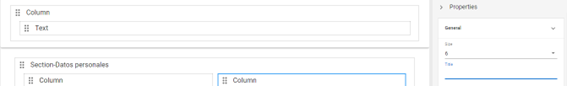<figcaption>
Apartado de propiedades de una sección
</figcaption></figure>

Comenzaremos a añadir componentes al formulario. Algunos elementos serán útiles para mostrar información estática, mientras que otros te permitirán recoger datos de los usuarios.

## Campos estáticos

Entre los campos estáticos, encontramos las herramientas _**Text**_ e _**Image**_, que permiten añadir un texto o imagen fijos. Por lo general, este tipo de campos se utilizan para añadir títulos, logos o brindar un mensaje de ayuda o información destacada al usuario final.

<figure>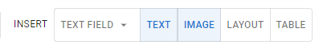<figcaption>
Campos de texto e imagen estáticos
</figcaption></figure>

En el formulario predeterminado, este campo se utiliza dentro de la columna en el apartado superior para mostrar el nombre del formulario. Al igual que con las secciones, puedes dirigirte a _**Properties > General > Title**_ para modificar su nombre. Lo llamaremos con el mismo nombre que el formulario: “Actualización de datos”.

<figure>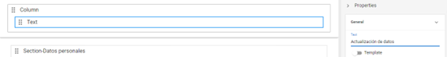<figcaption>
Renombrando un campo de texto
</figcaption></figure>

## Campos dinámicos

Los campos dinámicos presentan mayor variedad, dado que están pensados para registrar distintos tipos de datos. Además de las tablas, que tienen su propio botón en la cinta de herramientas, puedes encontrar todas las opciones que necesites en el desplegable _**Text field**_.

<figure>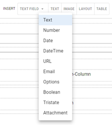<figcaption>
Campos dinámicos
</figcaption></figure>

Vamos a añadir a nuestro formulario dos tipos de campos básicos:

<table><thead><tr><th width="123">Campo</th><th>Modo de uso</th></tr></thead><tbody><tr><td><strong>Text</strong></td><td>Permite ingresar una línea de texto, resultando útil para datos breves como nombres y direcciones.</td></tr><tr><td><strong>Number</strong></td><td>Está configurado para ingresar solo caracteres de tipo numérico, siendo útil para aplicarse, por ejemplo, en números de teléfono, identificaciones y cantidades.</td></tr></tbody></table>

Selecciona la opción _**Text**_ en el desplegable y pulsa sobre la primera columna de la Sección “Datos personales” para añadirlo.

El apartado _**Properties > Name**_ se utiliza para colocar un nombre que identifique a cada campo particular del formulario. Es recomendable que los nombres no tengan espacios y sean claros, dado que solo se visualizarán internamente, permitiendo recuperar y organizar los datos. Renombra este campo como “apellido\_nombre” y pulsa sobre _**OK**_ (o la tecla _enter_).

<figure>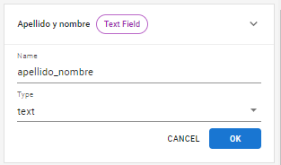<figcaption>
Propiedad <em><strong>Name</strong></em>
</figcaption></figure>

Coloca otro campo de texto debajo, cambia su nombre a “nacionalidad” y pulsa _**OK**_.

Ahora repite el mismo procedimiento en la segunda columna, pero esta vez añadiendo un campo de tipo numérico y otro de tipo texto. Selecciona la opción _**Number**_ en el desplegable y coloca un campo al que llamaremos “dni”. Luego desde la opción _**Text**_ inserta un campo donde el usuario ingresará su clave tributaria, al que llamaremos “cuil\_cuit” según su denominación en Argentina.

Los campos deberían verse del siguiente modo:

<figure>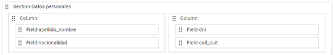<figcaption>
Campos con propiedades <em><strong>Name</strong></em> definidas
</figcaption></figure>

Más adelante, veremos en profundidad las propiedades, apariencia y comportamientos de cada tipo de elementos y conoceremos distintas opciones de validación. Por el momento, nos enfocaremos en el apartado _General_:

<table><thead><tr><th width="124">Propiedad</th><th>Función</th></tr></thead><tbody><tr><td><strong>Label</strong></td><td>Permite establecer el nombre que verá el usuario final al acceder al formulario.</td></tr><tr><td><strong>Size</strong></td><td>Define el ancho del campo. Al igual que ocurre con las columnas y las secciones, las 12 unidades son proporcionales e implican que el campo ocupa el 100% de la columna en la que se encuentra. Este número se puede reducir disminuyendo su tamaño y liberando espacio para insertar nuevos campos junto a los existentes.</td></tr><tr><td><strong>Required</strong></td><td>Establece si el formulario es un campo obligatorio (<em>True</em>) o no lo es (<em>False</em>).</td></tr></tbody></table>

Selecciona cada uno de los campos que has creado y establece los siguientes valores:

* _**Label**_ será nombrado en cada caso: _Apellido y nombre, Nacionalidad, DNI y Clave tributaria._
* _**Size**_ mantendrá el ancho por defecto de 12 unidades.
* _**Required**_ tendrá el valor _True_ en los cuatro campos, para volverlos obligatorios.

<figure>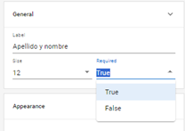<figcaption>
Propiedad <em><strong>Required</strong></em>
</figcaption></figure>

Para comprobar tus avances, puedes utilizar el modo Live Editor del editor visual, que encontrarás con el nombre _**Preview**_ a la derecha de los elementos de formulario. Al activar el botón, te mostrará una previsualización en tiempo real de tu formulario, donde puedes seguir editando las propiedades de sus componentes y comprobando su funcionamiento.

<figure>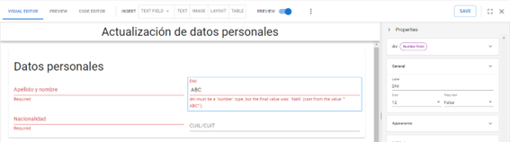<figcaption>
Modo de previsualización en tiempo real
</figcaption></figure>

La principal restricción de este modo es que no podrás agregar nuevos campos o elementos de layout, por lo que deberás desactivarlo para seguir trabajando en el diseño de tu formulario.

Ahora es momento de completar la segunda sección: “Datos de contacto”. Añade un campo de tipo _Text_ en la primera columna. Definiremos para él las propiedades _**Name:**_ “email” y _**Label:**_ “Correo electrónico”. Añade otro campo de tipo _**Number**_ en la segunda columna, con las propiedades _**Name:**_ “tel” y _**Label:**_ “Teléfono”. Si añades un componente por error, siempre puedes eliminarlo seleccionando dicho elemento y pulsando sobre la opción _**Delete**_ que se muestra en la esquina inferior derecha.

<figure>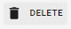<figcaption></figcaption></figure>

Cuando termines, pulsa _**Save**_ para guardar el formulario y dirígete a la opción _**Preview**_ que se encuentra junto a los botones del editor visual y el editor de código para comprobar el diseño final de tu formulario en esta primera etapa.

<figure>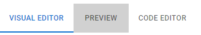<figcaption>
Opción de <em><strong>Preview</strong></em>
</figcaption></figure>

Finalmente, pulsa la cruz para cerrar el formulario y regresar a la pantalla principal de tu espacio de trabajo.

<figure>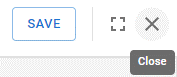<figcaption>
Opciones de <em><strong>Guardar</strong></em> y <em><strong>Salir</strong></em>
</figcaption></figure>

¡Felicitaciones! Has completado el inicio rápido aprendiendo a crear un formulario con nuevas secciones y componentes para recabar datos básicos. Continúa avanzando para conocer más sobre las características y funciones de RPA Connect.
