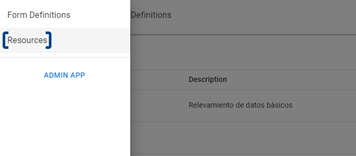
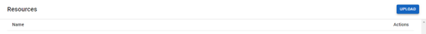
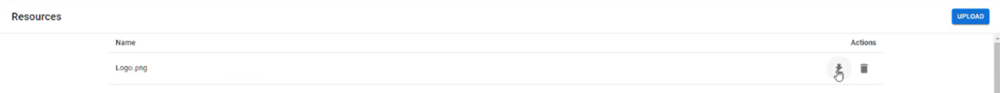

# Carga de recursos

Para comenzar, una vez que hayas iniciado sesión y te encuentres en tu espacio de trabajo, pulsa sobre el ícono de tres franjas horizontales en la esquina superior izquierda de la pantalla para desplegar el menú lateral.

<figure><figcaption>
Menú de la aplicación
</figcaption></figure>

Haz clic en _**Resources**_ para ingresar al repositorio de recursos.

<figure><figcaption>
Acceso al repositorio de recursos
</figcaption></figure>

Aquí es donde encontrarás todos los materiales que cargues a RPA Connect. Para subir tu primer archivo, haz clic en el botón _**Upload**_ en la esquina superior derecha.

<figure><figcaption>
Carga de archivos
</figcaption></figure>

Selecciona el archivo que desees utilizar, ya sea una imagen o un documento, y confirma para iniciar la carga. Es recomendable que su nombre te permita identificarlo fácilmente, ya que deberás copiar la denominación correcta en tu formulario para utilizar un recurso. Una vez que esté cargado, encontrarás dos opciones de utilidad bajo el apartado _**Actions**_, que te permitirán descargar nuevamente el archivo (ícono de flecha) o eliminarlo (ícono de cesto).

<figure><figcaption>
Descargar un archivo
</figcaption></figure>

Puedes cargar todos los materiales que creas probable utilizar o bien subirlos a medida que los necesites, de cualquier modo, es importante que mantengas el repositorio ordenado y actualizado para facilitar el flujo de trabajo y evitar posibles errores. A continuación, veremos cómo añadir un recurso de imagen en un formulario. Intenta cargar un archivo .jpg o .png de un logo para utilizarlo.
