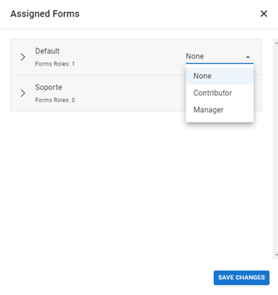
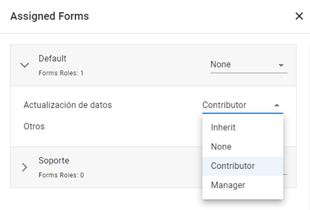
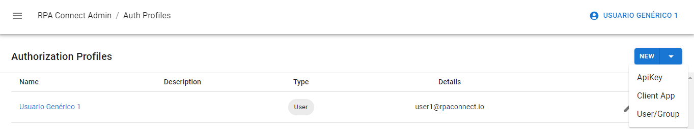
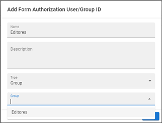

# Roles and Permissions

There are advanced configuration options that allow you to assign roles to users and groups enabled on the platform for each workspace, as well as for specific form templates. Unlike _**Users And Groups**_, which grants or restricts access to the _**Build**_ application through the _**Form.Manage**_ role, _**Authorization profiles**_ provide stricter control over the permissions users have on specific content within this application.

To get started, navigate to the _**Authorization profiles**_ section from the side menu, where you'll find a list of active profiles. By clicking on the profile name, displayed in blue, you can manage the permissions enabled for it. Each profile can assume one of three possible roles for a workspace, which can be selected by clicking the arrow to the right of the workspace name:

* **None:** Has no permissions, meaning the user cannot view the forms on their RPA Connect portal homepage or work on created instances.
* **Contributor:** The templates from that workspace will be available on their homepage, and they can create new form instances.
* **Manager:** In addition to having _**Contributor**_ permissions, they can also view all form instances submitted by profiles with access to the template.

<figure><figcaption>
Role assignment visualization
</figcaption></figure>

By clicking the arrow to the left of the workspace name, you can expand the list of form templates contained within it and also assign specific roles to each of them. In addition to the three options mentioned earlier, there is the _**Inherit**_ option, which means inheriting the permission assigned to the workspace without changes.

<figure><figcaption>
Role definition within a workspace
</figcaption></figure>

The _**New**_ button in the upper-right corner allows you to create a new profile, with three possible types: _**User/Group**_, _**ApiKey**_, and _**Client App**_. We will focus on the first two.

<figure><figcaption>
Admin App profiles
</figcaption></figure>

## User or Group Profile

Building on what was covered in the previous section, let's start with users and groups. Click on _**New > User/Group**_ and add a name and, optionally, a description for the profile. Select the _**User**_ type and enter the email address registered in _**Users And Groups**_. Try assigning different types of profiles to workspaces and the forms within them. The changes will be reflected on the RPA Connect portal homepage and in the form instance submission section, where users will see more or less information depending on the level of authorization granted.

Click _**Save changes**_ to finish.



To add a group, follow the same steps as above, but select the _**Group**_ type instead of _**User**_. Unlike workspaces, in this case, you do not need to enter an ID; the application will display a dropdown menu where you can select the desired group from those already registered.

<figure><figcaption>
Group profile
</figcaption></figure>

## ApiKey

The _**ApiKey**_ allows authentication from robots, automation, or code that interacts with the forms. You can assign the same roles to this type of profile as you would to a user or group.

To create a new profile, click on _**New > ApiKey**_, enter a name and, optionally, a description, and click _**Add**_. The system will generate a unique key that you must copy and save.



Keep in mind that when using the RPA Connect API, you will need to use this _**ApiKey**_ for authentication.