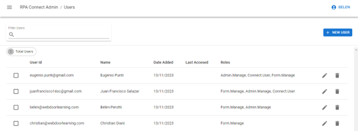
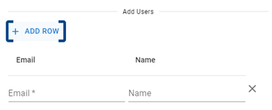
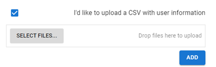
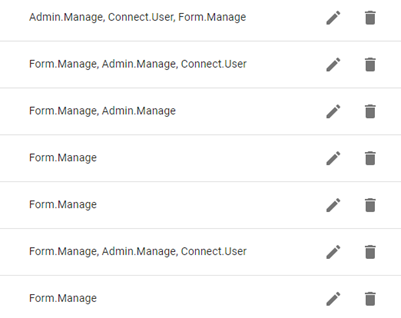
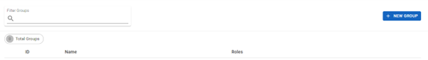
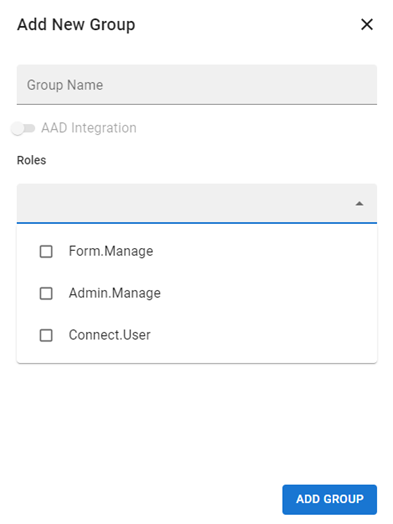
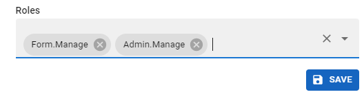
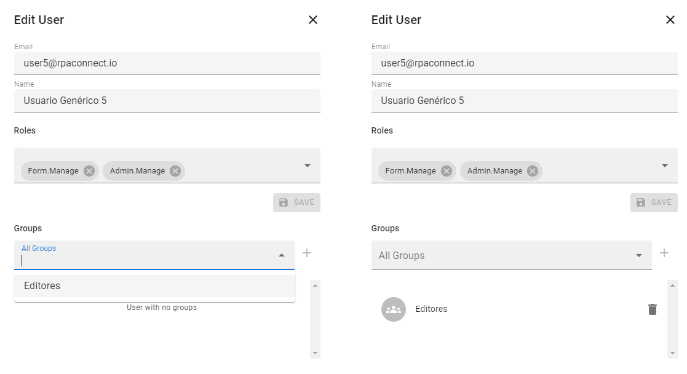

# User and Group Management

Users include all active accounts in your platform environment that have access to RPA Connect, each with their roles and permissions. Additionally, users can be organized into groups, which can also be assigned specific properties, as we will see below.

## Users

When you access the _**Users**_ section, you will find a list of all active users on the platform. If this list is extensive, you can always use the filter with a magnifying glass icon to search for a specific user.

<figure><figcaption>
Main screen of the <em>Users</em> section
</figcaption></figure>

From _**Admin App**_, you can assign, add, or restrict different types of roles to users. These roles are summarized as follows:

* **Form Manage:** Allows access to the _**Build**_ development tool. Only users with this role assigned will be able to create and manage forms, while others will receive an error message when attempting to access the application.
* **Admin Manage:** Enables access to the administration application. Users with this role will be able to manage platform users and configure all the options we will see in this section.
* **Connect User:** Assigns a specific property to users, allowing them to be assigned forms that have been defined as _**Connect only**_ by checking the corresponding option box in the form editing window of the _**Build**_ application.

Roles are specific and independent of each other, so you can assign one, several, or all roles to a single user, depending on the functions and actions they need to perform.

To create a new user, click on the _**New user**_ button, assign the desired roles to the user, and then enter their email address and the name to be assigned:

_\[VIDEO: User creation]_

If you need to create multiple users with the same permissions, you can add more rows by clicking on the _**Add row**_ option.

<figure><figcaption>
Adding multiple users
</figcaption></figure>

If you already have an Excel spreadsheet with this information, _**Admin App**_ provides an option to import it directly, saving time in the process. Check the box labeled “I’d like to upload a CSV with user info,” click on _**Select files…**_, select the file containing the email and name columns (or drag and drop it into the field labeled “Drop files here to upload”). Assign the desired permissions and click _**Add**_ to finish.

<figure><figcaption>
Importing a CSV file
</figcaption></figure>

To delete a user, click the trash can icon. Note that the system will not ask for confirmation before deleting the user.

To edit a user's information, click the pencil icon. You can modify the user's email address/ID, as well as remove existing permissions or assign new ones.

<figure><figcaption>
Editing and deleting users
</figcaption></figure>

Editing also allows you to manage the groups a user belongs to. To assign them to a new group, the group must have been created beforehand. Next, you will learn how to create a new group with specific roles and how to add users to it.

## Groups

Expand the side menu and go to the _**Users And Groups > Groups**_ section. From there, you can manage all the groups you have created. To create a new group, click on _**New group**_.

<figure><figcaption>
Group creation
</figcaption></figure>

A window will open where you can name the group and assign the corresponding roles. Depending on the chosen workflow and internal task distribution, you can create, for example, a group with the _**Form.Manage**_ role for form developers and another with the _**Admin.Manage**_ role for those managing user creation and deletion.

<figure><figcaption>
Defining group properties
</figcaption></figure>

To finish, click on _**Add group**_. The new group will appear in the list on your main screen, showing an ID that has been automatically assigned to it. Later, you will learn how to use it. Once the group is created, you can access it via the edit button to define the users who will be part of it.

You can also change the name and assigned roles. Be sure to click _**Save**_ for the changes to take effect.

<figure><figcaption>
Group roles
</figcaption></figure>

Try creating a group named “Editors” and assign it the _**Form.Manage**_ role. Users added to this group will not be able to manage other users or access Connect forms, as they will only have permissions to develop forms in the _**Build**_ application. Click _**Add group**_ to finish, and then edit the group to add two members.

You can add or remove members from a group using the edit button, always ensuring that they are registered in the _**Users**_ section. You can also do this in the same section by accessing a user and selecting the group to add or remove.

_\[VIDEO: Group creation]_

<figure><figcaption>
Group management from the <em>Users</em> section
</figcaption></figure>
