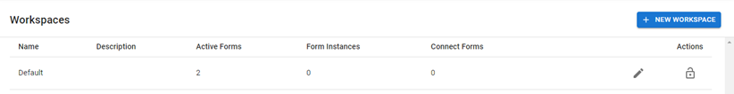
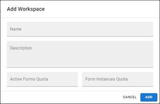
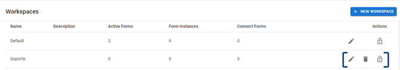
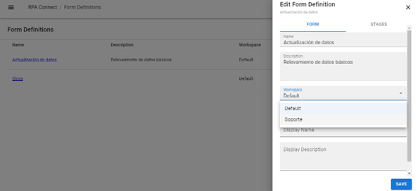
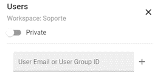

# Workspaces

Workspaces allow you to segment and organize the forms created on the platform, for example, by grouping them by project or area (logistics, purchasing, production, etc.).

From the side menu, go to _**Workspaces**_. You will see the list of workspaces in your environment, the number of active forms in each of them (Active Forms), the existing form instances (Form instances), and the Connect-type forms they include. That is, those marked as _**Connect only**_ can only be assigned to Connect users (Connect Forms).

<figure><figcaption>
Home screen of the <em>Workspaces</em> section
</figcaption></figure>

Click on _**New workspace**_ to create a new form. A window will appear where you can set the following details:

* **Name:** the name you will use to identify the workspace (e.g., the name of the project or the area it corresponds to).
* **Description:** a brief overview of the characteristics of this workspace.
* **Active Forms Quota:** the maximum number of active form templates this workspace can contain.
* **Form Instances Quota:** the monthly quota of form instances that can be submitted.

Press _**Add**_ to save.

<figure><figcaption>
Creating a workspace
</figcaption></figure>

Once the form is created, it will appear in the list along with three possible actions: edit, delete, and assign users. Below, we will explain what each of these actions means.

<figure><figcaption>
Actions linked to workspaces
</figcaption></figure>

From the pencil-shaped icon, you can edit the workspace details, such as name, description, and the maximum quota of active form templates and instances.

From the trash can icon, you can delete the workspace. Keep in mind that _**Admin App**_ will only allow you to delete workspaces that do not contain active forms. Therefore, if you wish to delete a workspace that is currently in use, you will need to go to the _**Build**_ application and either delete its forms or move them to a different workspace using the edit button:

<figure><figcaption>
Selecting a workspace from a form
</figcaption></figure>

From the lock icon, you can configure privacy settings. By default, each new workspace is created in private mode, meaning it will not be visible to users.

<figure><figcaption>
Group privacy settings
</figcaption></figure>

You can toggle the privacy switch to change the workspace's status from private to public (making it visible to all users) or assign specific users to the workspace, just like groups, by copying and pasting the ID generated for it.



Once your workspace is visible, you can select it as the workspace for new forms you create in the _**Build**_ application. Additionally, you can assign existing templates to the new workspace using the edit button.