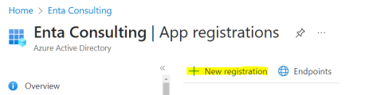
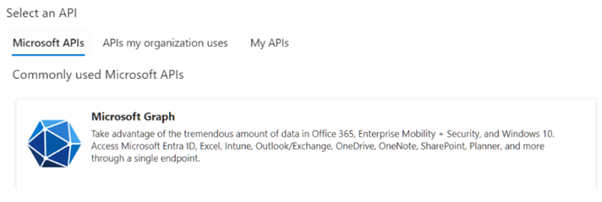
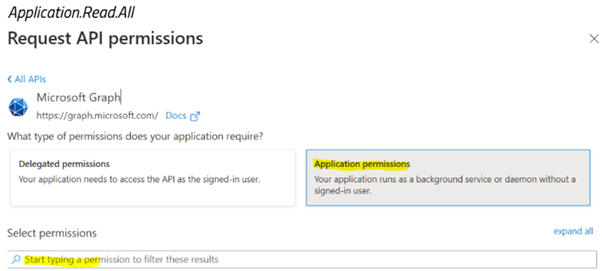
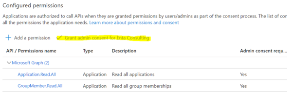

# Microsoft Teams Notification Configuration

To allow the RPA Connect application to generate notifications through Teams, you first need to create the corresponding application. From Microsoft Entra ID, navigate to _**App Registration > New registration**_.

<figure><figcaption>
Application registration
</figcaption></figure>

Enter the desired name for the application (e.g., RPA Connect – Notifications) and select the option _**Accounts in this organizational directory only**_. Click the _**Register**_ button to confirm.

Next, go to _**API Permission**_ and press _**Add a Permission**_. Select the Microsoft Graph API to configure its permissions. This will allow notifications to be sent to groups and users.

<figure><figcaption>
API selection
</figcaption></figure>

Click on _**Application permissions**_ and use the search bar to find the permissions _**GroupMember.Read.All**_ and _**Application.Read.All**_.

<figure><figcaption>
Application permissions
</figcaption></figure>

Once you have located them, check the box _**Grant admin consent…**_ to authorize their use.

<figure><figcaption>
Permission authorization
</figcaption></figure>