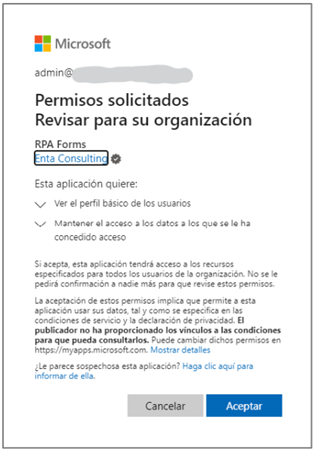

# Synchronization Authorization

When a new environment is enabled, it is first necessary to authorize synchronization with Microsoft Entra ID by providing administrator consent.

To begin, a user with global administrator permissions in Entra ID must access the URL https://app.rpaconnect.io/Account/AdminConsen?tenantid=\<tenantid> (where _**\<tenantid>**_ is the ID of the environment where the process will be performed) and authenticate.

After authentication, the following window will appear, displaying the necessary permissions to establish synchronization. Click _**Accept**_ to proceed.

<figure><figcaption>
Permission Acceptance
</figcaption></figure>

Once this step is successfully completed, a confirmation message will appear notifying that the consent has been accepted, and the connection will be authorized. This will create access to the RPA Connect application in Entra ID and also allow users to log in to the RPA Connect application with their corporate accounts.

To do this, remember to select the option “Sign in with your work account” when accessing the platform, as we saw in the [Quick Start](../../).