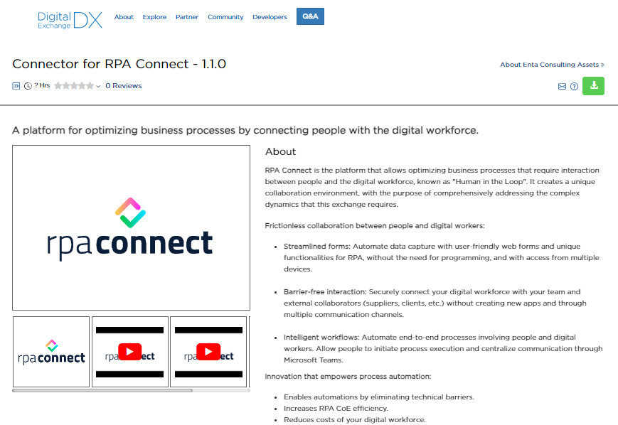
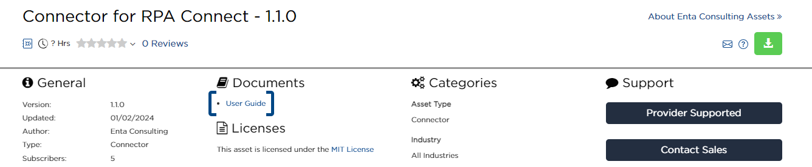

# BluePrism

The RPA Connect connector is available on BluePrism's DigitalExchange portal. You can access it through the following link: [https://digitalexchange.blueprism.com/dx/entry/74617/solution/rpa-forms](https://digitalexchange.blueprism.com/dx/entry/74617/solution/rpa-forms)

<figure><figcaption>
RPA Connect Connector on the DigitalExchange portal
</figcaption></figure>

Below, we will cover the key points of this tool, but keep in mind that you can access the connector's user guide on the DigitalExchange portal for a more detailed approach.

<figure><figcaption>
RPA Connect Connector User Guide
</figcaption></figure>

By the end of this walkthrough, you will have the necessary knowledge to:

* Create an authentication credential for connecting with BluePrism.
* Generate, query, and delete form instances.
* Retrieve the values entered in a form as well as query and download its attachments, among other actions.