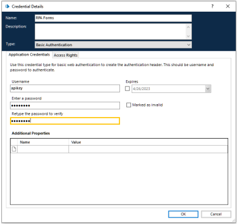

# Creating an Authentication Credential

To begin the process, go to Authorization Profiles and create an ApiKey, which will be used by BluePrism. Once you have added it, copy the ApiKey that is automatically generated as we saw earlier in the [Roles and Permissions section of Admin App](../../administracion/admin-app/roles-y-permisos.md).

Next, access BluePrism and create a new authentication credential. Enter the desired name and select the type _**Basic Authentication**_. Set the username as “apikey” and, for the key, use the ApiKey copied in the previous step.

<figure><figcaption>
Creating an authentication key
</figcaption></figure>

Click _**OK**_ to confirm and finish.