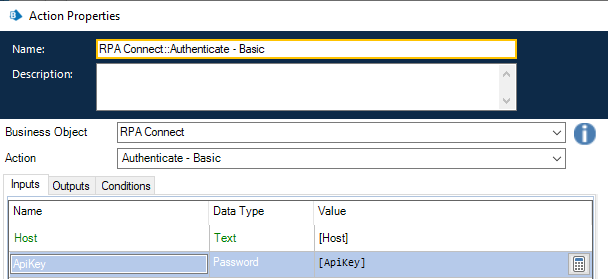
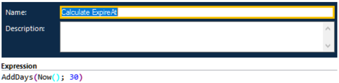
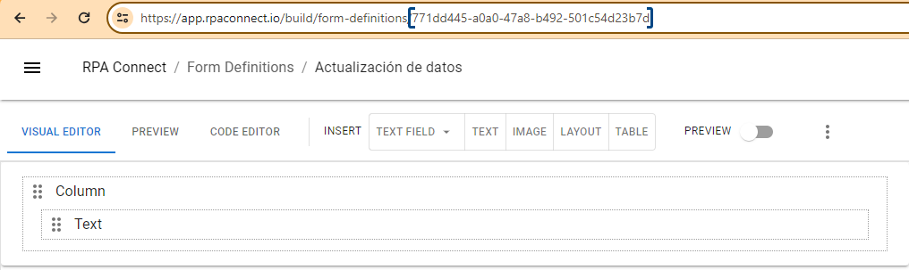
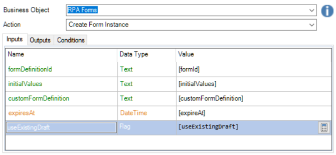

# Generating a Public Form Instance

Each time an RPA Connect form instance is generated, an ID and an expiring token are obtained, which allow the creation of a specific link to access the instance via a browser. Let’s see how this process is carried out.

First, authentication is required. As the _**host**_, we will enter “[https://app.rpaconnect.io](https://app.rpaconnect.io)” and as the _**apikey**_, the ApiKey obtained during the credential creation process.

<figure><figcaption>
Values for authentication
</figcaption></figure>

Once authentication is completed, you can calculate the token's expiration date. The default duration period is 30 days, but it can be extended or shortened depending on specific needs for each case.

<figure><figcaption>
Calculating the token expiration date
</figcaption></figure>

Next, we will create a form instance. To do this, we need to obtain the template ID, which can be found in its URL:

<figure><figcaption>
Template ID in its URL
</figcaption></figure>

When creating the instance, the token expiration date configured earlier (_**ExpiresAt**_) will also be included as input, along with other advanced options that we will discuss later.

<figure><figcaption>
Creating a form instance
</figcaption></figure>

When executed, this action will generate three outputs, which are:

* **formInstanceId:** the ID of the instance.
* **sharedFormToken:** the token that will remain accessible for the previously established duration. It is important to note that once the token expires, the instance will no longer be accessible, but the information associated with it will remain stored until it is deleted.
* **URL:** a browser-accessible address consisting of a string formed by the base URL of a public link (app.rpaconnect.io/public/fill?token=) and the token.