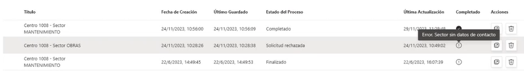
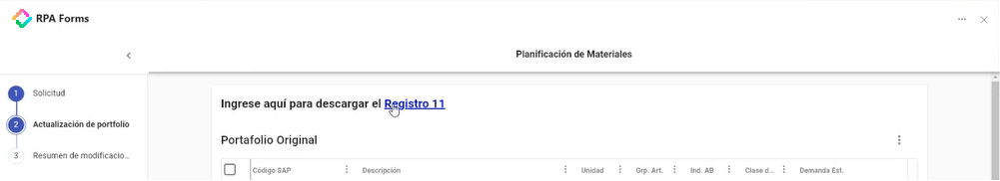

# Other Actions

In addition to creating and querying instances of a form, there are multiple actions applied to the use of forms that provide additional value and help optimize the workflow.

Let's take a look at some of them below.

## **Get Form Instance State**

Returns the state of a form instance, i.e., whether it is in draft or confirmed state. It includes the following parameters:

<table><thead><tr><th width="165">Parameters</th><th width="102">Direction</th><th width="126">Data Type</th><th>Description</th></tr></thead><tbody><tr><td><strong>formInstanceId</strong></td><td>In</td><td>Text</td><td>ID of the form instance</td></tr><tr><td><strong>state</strong></td><td>Out</td><td>Text</td><td>State of the form instance</td></tr><tr><td><strong>lastSaved</strong></td><td>Out</td><td>Text</td><td>Date and time of the last save</td></tr><tr><td><strong>Response</strong></td><td>Out</td><td>Collection</td><td>Collection containing all the above data of the form instance</td></tr></tbody></table>

## **Get Form Instance Response**

Includes the properties of _**Get Form Instance State**_ but also allows collecting the data entered in a form instance, displaying them as values. Its properties are as follows:

<table><thead><tr><th width="180">Parameters</th><th width="102">Direction</th><th width="126">Data Type</th><th>Description</th></tr></thead><tbody><tr><td><strong>formInstanceId</strong></td><td>In</td><td>Text</td><td>ID of the form instance</td></tr><tr><td><strong>formDefinitionID</strong></td><td>Out</td><td>Text</td><td>ID of the template to which the instance belongs</td></tr><tr><td><strong>formInstanceId</strong></td><td>Out</td><td>Text</td><td>ID of the form instance, as it will be included in the final output</td></tr><tr><td><strong>lastSaved</strong></td><td>Out</td><td>Text</td><td>Date and time of the last save</td></tr><tr><td><strong>state</strong></td><td>Out</td><td>Text</td><td>State of the form instance</td></tr><tr><td><strong>values</strong></td><td>Out</td><td>Collection</td><td>Values entered in the form instance</td></tr><tr><td><strong>Response</strong></td><td>Out</td><td>Collection</td><td>Collection containing all the above data of the form instance</td></tr></tbody></table>

## **Get Form Instance Token**

Allows generating a new public token for a form instance (e.g., because it has expired) by defining the following parameters:

<table><thead><tr><th width="184">Parameters</th><th width="102">Direction</th><th width="126">Data Type</th><th>Description</th></tr></thead><tbody><tr><td><strong>formInstanceId</strong></td><td>In</td><td>Text</td><td>ID of the form instance</td></tr><tr><td><strong>expiresAt</strong></td><td>In</td><td>Date and Time</td><td>Expiration date of the token</td></tr><tr><td><strong>formInstanceId</strong></td><td>Out</td><td>Text</td><td>ID of the form instance, as it will be included in the final output</td></tr><tr><td><strong>sharedFormToken</strong></td><td>Out</td><td>Text</td><td>Token that allows viewing and modifying the generated instance</td></tr><tr><td><strong>URL</strong></td><td>Out</td><td>Text</td><td>Accessible URL formed by the base URL and the token</td></tr><tr><td><strong>Response</strong></td><td>Out</td><td>Collection</td><td>Collection containing all the above data of the form instance</td></tr></tbody></table>

## **Set Form Instance Process Info**

Allows users of the portal or the Teams application to review the status of the forms they have submitted, which is reflected in the "Process Status" and "Completed" columns.

<figure><figcaption>
Visualization of a form's status in the Portal
</figcaption></figure>

This action is configured with the following parameters:

<table><thead><tr><th width="201">Parameters</th><th width="102">Direction</th><th width="126">Data Type</th><th>Description</th></tr></thead><tbody><tr><td><strong>formInstanceId</strong></td><td>In</td><td>Text</td><td>ID of the form instance</td></tr><tr><td><strong>status</strong></td><td>In</td><td>Text</td><td>Processing status of the instance to be displayed to the user</td></tr><tr><td><strong>endState</strong></td><td>In</td><td>Text</td><td>Final processing status, with options "OK" or "Error"</td></tr><tr><td><strong>completionMessage</strong></td><td>In</td><td>Text</td><td>Message specifying the conditions under which the instance was completed</td></tr></tbody></table>

## **Delete Form Instance**

Allows deleting a form instance. Its main properties are:

<table><thead><tr><th width="201">Parameters</th><th width="102">Direction</th><th width="126">Data Type</th><th>Description</th></tr></thead><tbody><tr><td><strong>formInstanceId</strong></td><td>In</td><td>Text</td><td>ID of the form instance</td></tr><tr><td><strong>force</strong></td><td>In</td><td>Flag</td><td>Forces the deletion of an instance</td></tr></tbody></table>

## **Get Attachments / Download Attachment**

These actions are closely related, as the first allows listing all attachments in the fields of a specific instance, and the second allows downloading all files from the obtained list.

Let's look at the properties of the _**Get Attachments**_ action:

<table><thead><tr><th width="167">Parameters</th><th width="104">Direction</th><th width="127">Data Type</th><th>Description</th></tr></thead><tbody><tr><td><strong>formInstanceId</strong></td><td>In</td><td>Text</td><td>ID of the form instance</td></tr><tr><td><strong>stageIndex</strong></td><td>In</td><td>Number</td><td>Stage from which the attachments are obtained</td></tr><tr><td><strong>Attachments</strong></td><td>Out</td><td>Collection</td><td>List of URLs to download the files</td></tr></tbody></table>

On the other hand, the _**Download Attachment**_ action includes the following parameters:

<table><thead><tr><th width="171">Parameters</th><th width="102">Direction</th><th width="126">Data Type</th><th>Description</th></tr></thead><tbody><tr><td><strong>AttachmentURL</strong></td><td>In</td><td>Text</td><td>URL from which to download the file</td></tr><tr><td><strong>Path</strong></td><td>In</td><td>Number</td><td>Path where the downloaded file will be saved</td></tr></tbody></table>

## **Upload FormInstance Resource / Delete FormInstance Resource**

These actions allow, respectively, adding and deleting a resource from a form instance. The type of resources managed this way are not included in the form design but are added as external links with downloadable material:

<figure><figcaption></figcaption></figure>

The properties to define for uploading a new resource are:

<table><thead><tr><th width="171">Parameters</th><th width="102">Direction</th><th width="126">Data Type</th><th>Description</th></tr></thead><tbody><tr><td><strong>formInstanceId</strong></td><td>In</td><td>Text</td><td>URL from which to download the file</td></tr><tr><td><strong>Path</strong></td><td>In</td><td>Number</td><td>Path where the file will be attached</td></tr></tbody></table>

To delete it, however, the following must be set:

<table><thead><tr><th width="171">Parameters</th><th width="102">Direction</th><th width="126">Data Type</th><th>Description</th></tr></thead><tbody><tr><td><strong>formInstanceId</strong></td><td>In</td><td>Text</td><td>URL from which to download the file</td></tr><tr><td><strong>ResourceName</strong></td><td>In</td><td>Text</td><td>Name of the resource whose attachment is to be deleted</td></tr></tbody></table>