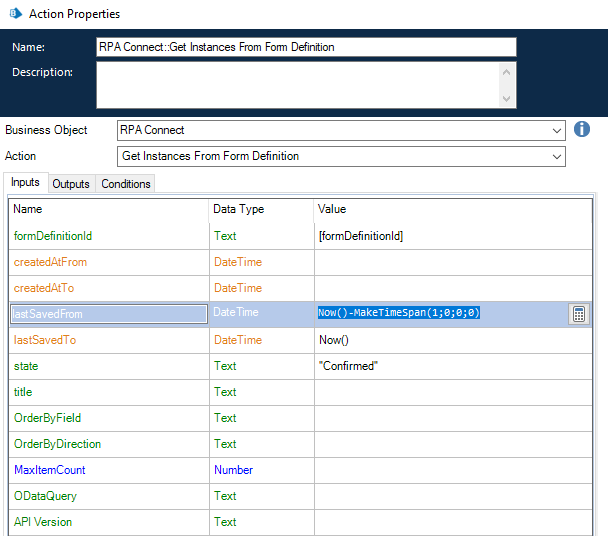

# Querying Instances of a Template

The action _**Get instances from form definition**_ allows you to automatically generate a list of all instances of a template, enabling the application of various filters based on the data you wish to retrieve, as well as parameters to sort them.

<figure><figcaption>
Retrieve instances from a form
</figcaption></figure>

Let's take a look at some of these functions:

* **createdAtFrom/createdAtTo:** allows you to gather data for a specific period by considering a range of instances based on the dates they were created.
* **lastSavedFrom/lastSavedTo:** configured similarly to the previous case, but enables segmentation by the period during which they were saved.
* **state:** allows filtering by the state of the instances (draft, confirmed, and canceled).
* **title:** allows filtering based on titles.
* **Order by…:** provides options for sorting the retrieved data.