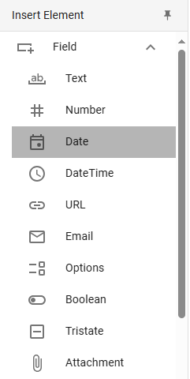
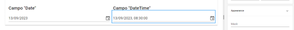

# Date and Time Fields

The _**Date**_ and _**DateTime**_ elements allow you to add a calendar where the user can select a day, month, and year (and, in the case of _**DateTime**_, also a time). Unlike other options for entering the same type of data (e.g., a text field with masks), these tools are especially useful for standardizing formats and avoiding errors when inputting information.

## Date

Date fields can be used to pinpoint important events in time or set deadlines. Since their function is very specific, their customization options are limited, and the format will already be predefined.

<figure><figcaption>
Insertion of a <em><strong>Date</strong></em> field
</figcaption></figure>

We will add a required _**Date**_ field in the "Personal Information" section of the form so that the user can select their date of birth. To do this, we will reorganize the existing fields in this section, reducing the space allocated for the ID and tax key so that they appear on the same row. Remember to go to _**Properties > General > Size**_ and adjust the size of both fields to 6 units so they occupy half the space. They will automatically rearrange, freeing up space below to insert the new _**Date**_ component.

Once added, we will define the value “fecha\_nacimiento” for the _**Name**_ property, which will be registered internally, and the value “Date of Birth” for the _**Label**_ property, which the user will see.



## DateTime

The _**DateTime**_ field works similarly, except that it includes a space for the time, which is useful for scheduling meetings, specifying reception or delivery times, and setting more precise deadlines, among other possibilities. The time format is also predefined by default in hours, minutes, and seconds.

<figure><figcaption>
Comparison of <em><strong>Date</strong></em> and <em><strong>DateTime</strong></em> fields
</figcaption></figure>