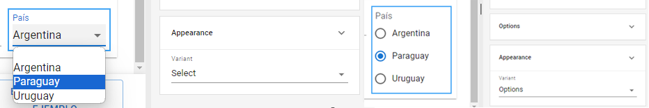
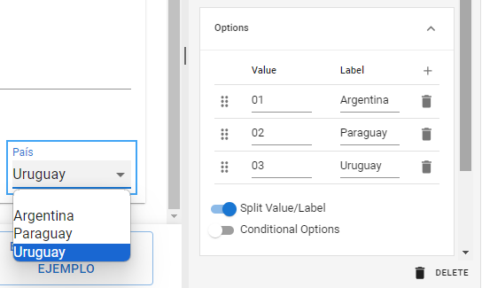
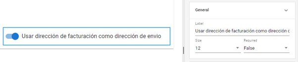
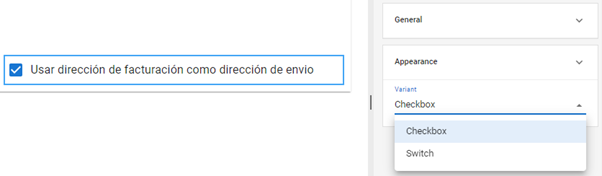

# Option Selection Fields

As we saw earlier, there are certain components that, due to their functionality, have a series of specific properties for their type. This is the case for fields that allow predefined options: _**Options**_, _**Boolean**_, and _**Tristate**_.

## Options

The _**Options**_ tool allows you to generate a list of predefined values from which the user will make a selection. Let’s analyze its functionality by including a field of this type in the "Address" section. Next to the "Province or department" field, place a new required field named "country," define its _**Label**_ as "Country," and reduce its size to 2 units. Don’t forget to save your changes as you progress in designing your form.



Within the _**Properties**_ section, go to the _**Options**_ subsection and click the "+" button next to the _**Value**_ description. A new value, "Option 1," will be added. You can repeat this step as many times as needed; in this case, we will add three options: Argentina, Paraguay, and Uruguay. If you want to delete an option, click the trash icon that appears to its right.



You can choose different display variants from the **Properties > Appearance** section. The main ones are:

* **Select:** Displays the options in a dropdown list.
* **Options:** Displays all options on the screen in a radio button format.

It is recommended that when choosing the format that best suits your form, you enable real-time preview and check its functionality.

<figure><figcaption>
Comparison of the <em><strong>Select</strong></em> and <em><strong>Options</strong></em> variants in the <em><strong>Appearance</strong></em> properties section
</figcaption></figure>

The _**Split Value/Label**_ option allows you to assign each option a real value different from what is displayed to the user. This helps simplify data processing. For example, if each country had an assigned internal code, we would display the country names in _**Label**_ and input the corresponding code for each in _**Value**_.

<figure><figcaption>
Configuration of the <em><strong>Split Value/Label</strong></em> function
</figcaption></figure>

## Boolean

Unlike _**Options**_, the Boolean field allows you to set a binary logic value (_yes/no_) where the user can define whether a condition is true or not by toggling the button on or off. This field retains the general properties common to input fields, and the value to be evaluated is defined in the _**Label**_ property.

<figure><figcaption>
Definition of a <em><strong>Boolean</strong></em> field
</figcaption></figure>

This type of tool can be used to report a status, mark compliance with certain characteristics, decide on the preference for an additional service, etc. Within _**Appearance**_, you can choose between the _**Switch**_ variant, which will display a slider like the example, and the _**Checkbox**_ variant, which will display a checkbox.

<figure><figcaption>
Alternative appearance of <em><strong>Boolean</strong></em> with the <em><strong>Checkbox</strong></em> format
</figcaption></figure>

## Tristate

Fields of this type generate a button with three possible states: true, false, and null (no response). Due to its simplicity, the configuration options for _**Tristate**_ are limited to general properties similar to those of _**Boolean**_. However, it differs from this field by allowing a neutral response without requiring the user to choose a predefined positive or negative value.

<figure><figcaption>
Properties of the <em><strong>Tristate</strong></em> field
</figcaption></figure>