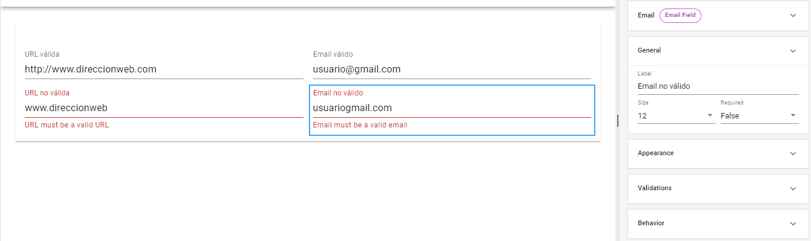
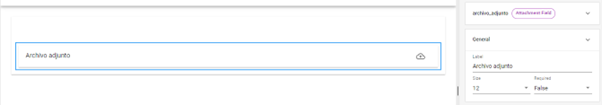

# Other Dynamic Fields

There are other fields with limited functionality that are less frequently used in form creation, such as the _**URL**_ and _**Email**_ tools. While they are pre-designed to receive and validate these types of data, it is possible to achieve the same results through advanced configuration of text-type fields.

<figure><figcaption>
Automatic validation of <em><strong>URL</strong></em> and <em><strong>Email</strong></em> fields
</figcaption></figure>

Another field with simple configuration and a specific function is the _**Attachment**_ field, which allows the user to add an attached file in that section of the form.\

<figure><figcaption>
Properties of the <em><strong>Attachment</strong></em> field
</figcaption></figure>