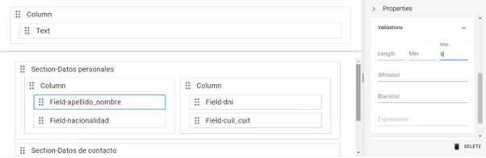
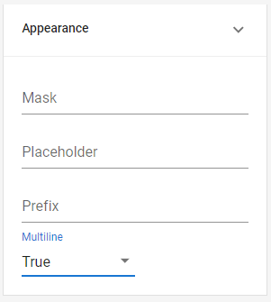
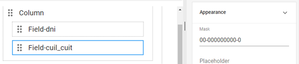
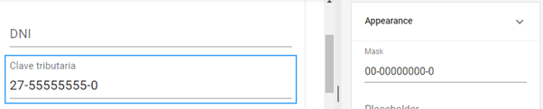
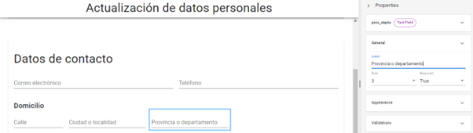
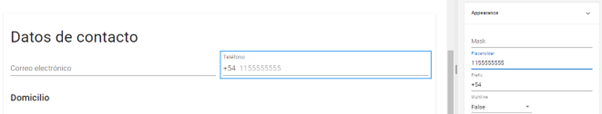

# Text and Numeric Fields

The most commonly used fields in most forms are also the simplest to configure and fill out: number fields (which only accept characters from 0 to 9) and text fields (which also allow letters and symbols). By modifying their properties, we can refine and adapt these types of fields for much more specific uses.

## Text

Text fields are versatile components with various configuration options. In the previously designed form, the text field was used in several instances: “Last Name and First Name,” “Nationality,” “Tax ID,” and “Email.” Let’s see how to adjust some of their characteristics based on the type of data we expect.

For the first two fields, we won’t be able to set too many conditions since it’s impossible to predict what data the user will enter. However, we can estimate that the text will be brief. Go to the _**Validations**_ section in the properties panel and enter the number 60 in the _**Max**_ field to set a maximum length of 60 characters.

<figure><figcaption>
Setting the <em><strong>Max</strong></em> property for the "Last Name and First Name" field
</figcaption></figure>

If the form includes a field for entering a description or message, it would be advisable to set a higher character limit and allow multiple lines of text. To do this, go to _**Properties > Appearance > Multiline**_ and select the _**True**_ option.

<figure><figcaption>
Setting the <em><strong>Multiline</strong></em> property
</figcaption></figure>

Regarding the tax ID, we know that in Argentina, this data always follows the same format: two numbers, a hyphen, eight numbers, another hyphen, and a control number. You can define the _**Mask**_ property to automatically generate this structure. To do this, go to the _**Appearance**_ section and set the following configuration:

<figure><figcaption>
Setting the <em><strong>Mask</strong></em> property for the "Tax ID" field
</figcaption></figure>

The application interprets the 0s as numeric characters and formats the data as it is entered. You can test its functionality by enabling real-time preview.

<figure><figcaption>
Preview of the "Tax ID" field
</figcaption></figure>

Now let’s add a new text field. To do this, insert a new column in the “Contact Information” section and name it “Address” in the _**Title**_ property. Add a text input field with the values “calle_dom” for _**Name**_ and “Street” for _**Label**_. Then, go to _**Properties > General > Size**_ to adjust its size to 2 units and set it as required (remember to set the _**Required**_ property to _**True**_). In the _**Validations**_ section of the properties panel, set the maximum length to 60 characters.



Create two additional required fields with a size of 3 units and a maximum length of 60 characters. For the first one, set the _**Name**_ and _**Label**_ values to “ciud_loc” and “City or Locality,” respectively. For the second one, set them to “prov_depto” and “Province or Department.”

<figure><figcaption>
Preview of the form with the "Address" section
</figcaption></figure>

## Number

As we’ve seen, numeric fields have a default restriction: they only accept characters from 0 to 9, as in the “ID” field. The restriction on the type of character entered also applies to masks since they are part of the data. This is why the structure with hyphens we applied to the tax ID uses a text field. Prefixes, on the other hand, are added externally, allowing the inclusion of letters or symbols. You can use this field to define a code that remains constant or a characteristic, such as a phone number.

Assuming all contacts are made from Argentina, use the _**Prefix**_ section in the “Phone” field of your form to add the +54 area code by default. In the _**Placeholder**_ field, you can enter a sample number to guide the user on how to complete it:

<figure><figcaption>
Setting the <em><strong>Prefix</strong></em> and <em><strong>Placeholder</strong></em> properties
</figcaption></figure>

In the “Address” column, add a numeric field for the street number between the “Street” and “City or Locality” fields. Reduce its size to 1 unit and set it as required. Then, set the values “num_calle_dom” and “Number” for _**Name**_ and _**Label**_, respectively, and set the maximum value for the field to 9999.

To the right of that field, create another one with the same characteristics for the postal code, but set the value “CP” for both _**Name**_ and _**Label**_. Remember to save your progress periodically to preserve the changes you make.

