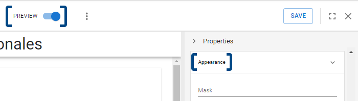
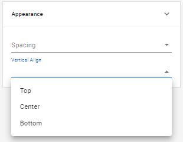
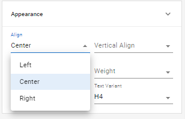
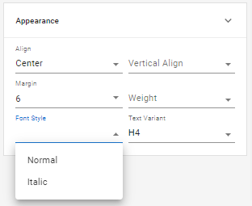
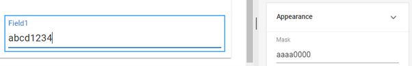
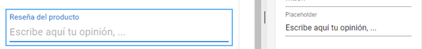
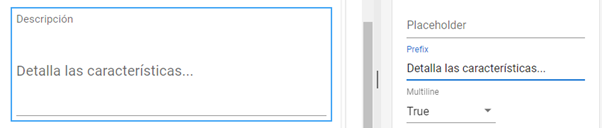

# Appearance

In the _**Appearance**_ section, you can configure various options related to the visual presentation of fields in the form. Although these types of properties focus on style or formatting choices that do not directly affect the functionality of the components, it is important to note that they can significantly impact their effectiveness: a clear and user-friendly design will facilitate proper management, while an unintuitive design may hinder it.

Let’s take a look at these properties for the different types of form elements. Remember that you can activate the _**Preview**_ mode while working to review in real-time how your choices affect the design.

<figure><figcaption>
Appearance section and location of the <em><strong>Preview</strong></em> button.
</figcaption></figure>

## Columns and Static Elements

Both columns and static elements like _**Text**_ and _**Image**_ have specific properties that define their positioning on the screen. The _**Vertical align**_ property is common to all of them and refers to the position of the components relative to the top and bottom margins of the section or column containing them. This property can be set to _**Top**_ (aligned at the top), _**Center**_ (aligned in the center), or _**Bottom**_ (aligned at the bottom).

<figure><figcaption>
Options for the <em><strong>Vertical align</strong></em> property
</figcaption></figure>

Another property that only affects columns is _**Spacing**_, which refers to the vertical space between elements within the same column. The higher this value, the greater the separation between fields.

The _**Align**_ property, found in both text and image fields, works similarly but defines the horizontal positioning of the content. This can be set to _**Left**_, _**Center**_, or _**Right**_, indicating alignment to the left, center, or right, respectively.

<figure><figcaption>
Options for the <em><strong>Align</strong></em> property
</figcaption></figure>

The _**Text**_ field offers a richer set of options, with the following properties:

<table><thead><tr><th width="147">Property</th><th>Function</th></tr></thead><tbody><tr><td><strong>Margin</strong></td><td>With values ranging from 0 to 10, this allows you to choose the margin of free space around the text. A lower value positions it closer to other components, while a higher value increases the separation.</td></tr><tr><td><strong>Weight</strong></td><td>Allows you to set the font weight to Light, Regular, or Bold.</td></tr><tr><td><strong>Font style</strong></td><td>Allows you to select the text style as Italic or Normal.</td></tr><tr><td><strong>Text variant</strong></td><td>Offers a series of preconfigured variants with different levels for headings, subtitles, body text, and other options.</td></tr></tbody></table>

<figure><figcaption>
Options for the <em><strong>Text</strong></em> field
</figcaption></figure>

## Input Fields

Although input fields offer a wider range of options depending on their functionality, most of them include the following appearance properties:

### Mask

This property defines a structure for the requested data, determining its possible values. To use this property, you need to understand certain parameters that define the type of characters allowed in each position of the string:

* The character "a" represents any letter, meaning that when included in the mask, the user can only enter an alphabetic character in that position.
* The character "0" represents any number. When included in the mask, it only allows values from 0 to 9 in that position.

<figure><figcaption>
Example of a mask that allows four alphabetic characters and four numeric characters
</figcaption></figure>

* If only a specific letter or number is valid in a position of the string, you must enter the corresponding character in the mask.
* If a character in the string must specifically be "a" or "0" (since these also serve as generic letter or number placeholders), you must precede it with a backslash "\\" to ensure only that specific character is accepted.
* Other characters like periods or hyphens can be added to the mask so that the entered data adopts this format.


Example of configuring Mask with different characters


### Placeholder

Sets a default text displayed to the user in the field, which can be used to provide examples or suggestions for completing it.

<figure><figcaption>
Adding a suggestion text using <em><strong>Placeholder</strong></em>
</figcaption></figure>

### Prefix

Adds an expression as a prefix to the data entered in the field, such as the area code before a phone number.

<figure><figcaption>
Setting a prefix for a phone number
</figcaption></figure>

### Multiline

You can choose the value _**True**_ if you want the field to have multiple lines (for a larger text area) or _**False**_ if it should be displayed in a single line.

<figure><figcaption>
Creating additional space by setting the value <em><strong>True</strong></em> for the <em><strong>Multiline</strong></em> property
</figcaption></figure>

Keep in mind that some field types, such as _**Date**_ or _**Attachment**_, will have fewer properties or may not display this section, as they have a predefined format that does not allow variations. Other fields, like _**Options**_ or _**Boolean**_, will have unique properties specific to their type, as we will see later.