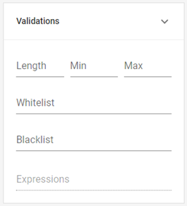

# Validations

In the _**Validations**_ section, you can set various conditions that the entered data must meet to be considered valid. By configuring these parameters, you can anticipate different response options and minimize the risk of potential errors, such as a code exceeding the allowed character limit.

In general, the basic validations you can set are:

<table><thead><tr><th width="133">Property</th><th>Characteristics</th></tr></thead><tbody><tr><td><strong>Min</strong></td><td>Refers to the minimum acceptable value for that field and is entered as a number. The type of value varies depending on the field; for example, in text fields, it refers to the minimum number of characters the input can contain, while in numeric fields, it refers to the lowest accepted number.</td></tr><tr><td><strong>Max</strong></td><td>Works the same way as <em><strong>Min</strong></em>, but instead defines the maximum allowed value.</td></tr><tr><td><strong>Whitelist</strong></td><td>
Allows you to create a list of the only values that will be accepted in that field. To input them, type each value and press <em>enter</em>, which will save and display them as tags in the configuration.

Unlike fields with options, the user will not see this list but will receive an error message clarifying the accepted values when entering an unapproved one.
</td></tr><tr><td><strong>Blacklist</strong></td><td>Configured in the same way as <em><strong>Whitelist</strong></em>, but unlike this property, it allows you to define a list of values that will not be accepted in that field. The user can enter any data except those listed here.</td></tr></tbody></table>

<figure><figcaption>
Validation properties
</figcaption></figure>

Next, we will look at another type of more complex validations that allow for the analysis of specific data and, if certain conditions are met, prevent the form from being submitted and display a custom error message: _**Validation Expressions**_.