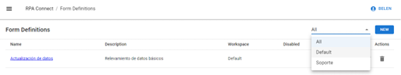
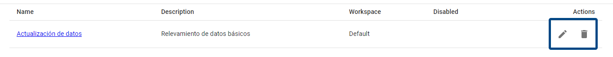
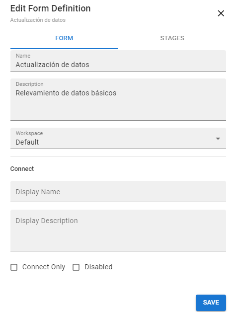
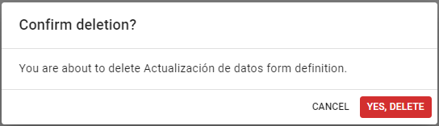
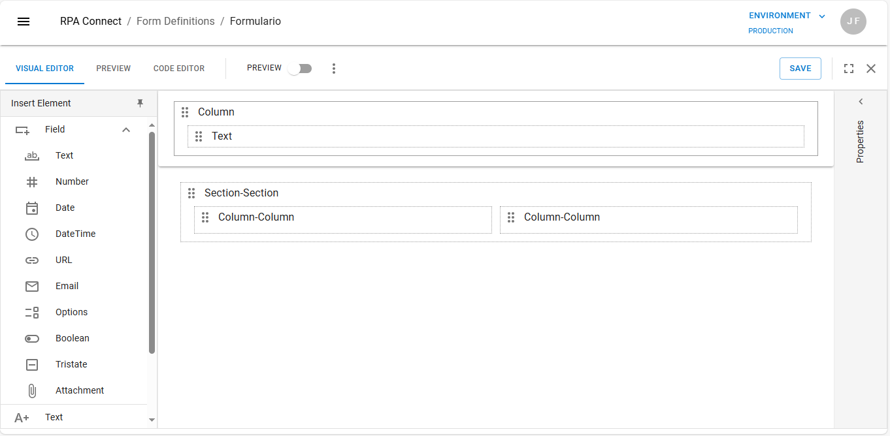
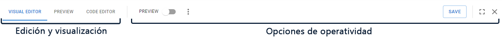
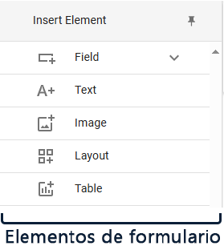

# Workspace

## Form Management

When creating a new form, it will appear in your workspace. The _**All**_ option selected in the dropdown menu indicates that all existing workspaces are being displayed. As you add new forms, you can use this menu to filter by the workspace where they were saved, making them easier to find.

<figure><figcaption>
Workspace
</figcaption></figure>

In the _**Actions**_ section, you will find the options to edit and delete the form, represented by the pencil and trash can icons:

<figure><figcaption>
Edit and delete actions
</figcaption></figure>

The first option will open the form window on the right-hand side, allowing you to edit its features, such as name and description. You can modify the necessary data and then click _**Save**_ to save the changes.

<figure><figcaption>
Editing a created form
</figcaption></figure>

With the delete option, you can discard a form you no longer need. The platform will request confirmation for this action. Click _**Cancel**_ to cancel the action and return to the workspace, or _**Yes, delete**_ to permanently delete it. Keep in mind that once a form is deleted, it cannot be recovered.

<figure><figcaption>
Form deletion confirmation
</figcaption></figure>

## Form Editor

By clicking on the form name, which will be highlighted as a blue link, you will access the editor to start organizing its components. By default, a preconfigured template will be displayed, which you can use, modify, or delete as needed.

<figure><figcaption>
Preconfigured form template
</figcaption></figure>

In the menu bar, you will find:

* Tools for editing and viewing the form, allowing you to switch between the visual editor, code editor, and preview.
* Other operational options, such as keyboard shortcuts, save, and close.

<figure><figcaption></figcaption></figure>

On the left-hand side, you will find the form elements, where you can select the fields you want to insert to display or record data.

<figure><figcaption></figcaption></figure>

We will delve deeper into each of these tools later, but for now, let's focus on the elements that make up the form and their layout. We will start by creating a basic design using the default template while you familiarize yourself with the functionality of RPA Connect.