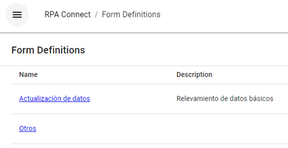
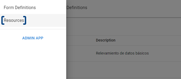
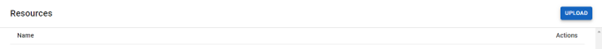
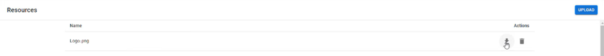

# Resource Upload

To get started, once you have logged in and are in your workspace, click on the icon with three horizontal lines in the upper left corner of the screen to open the side menu.

<figure><figcaption>
Application Menu
</figcaption></figure>

Click on _**Resources**_ to access the resource repository.

<figure><figcaption>
Accessing the resource repository
</figcaption></figure>

This is where you will find all the materials you upload to RPA Connect. To upload your first file, click on the _**Upload**_ button in the upper right corner.

<figure><figcaption>
File upload
</figcaption></figure>

Select the file you want to use, whether it is an image or a document, and confirm to start the upload. It is recommended that the file name allows you to easily identify it, as you will need to copy the correct name into your form to use a resource. Once uploaded, you will find two useful options under the _**Actions**_ section, which allow you to download the file again (arrow icon) or delete it (trash bin icon).

<figure><figcaption>
Downloading a file
</figcaption></figure>

You can upload all the materials you think you might use or upload them as needed. Either way, it is important to keep the repository organized and up-to-date to facilitate workflow and avoid potential errors. Next, we will see how to add an image resource to a form. Try uploading a .jpg or .png file of a logo to use it.