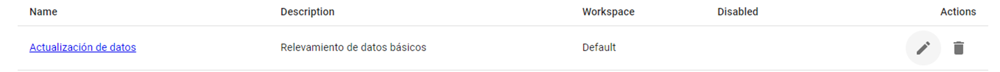
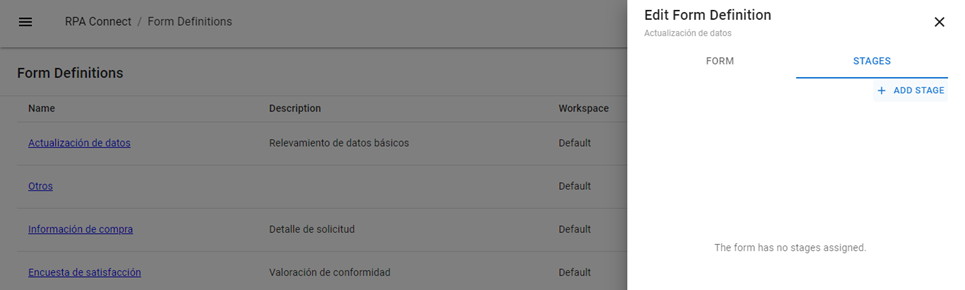
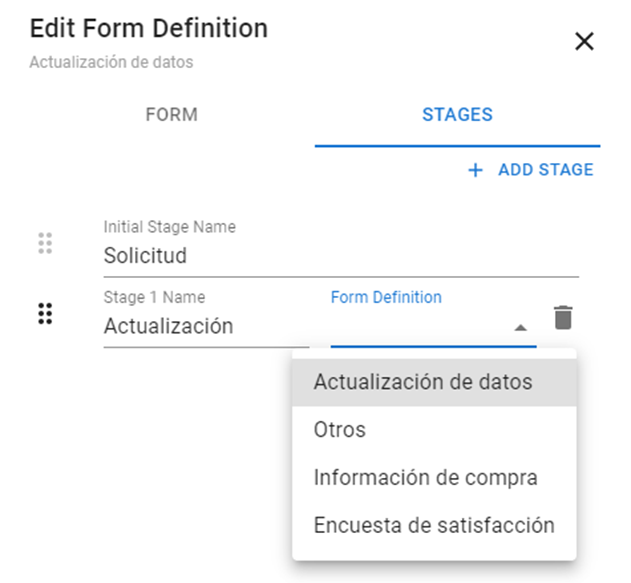

# Workflow Configuration

A workflow is a journey composed of a series of forms that must be completed in a step-by-step manner. This approach is especially useful when the information we need to gather during a process can be broken down into specific stages, and we need to centralize the tracking of all of them in one place. Additionally, using workflows allows the end user to review the responses they have provided within the framework of the same process, making it easier to locate and consult all completed forms for both senders and recipients.

For this example, we will start with the form previously developed for data updates and complete the process with purchase information and a satisfaction survey. However, the type and number of templates to use will depend on the workflow for each project.

Keep in mind that all forms in a workflow must have been created beforehand, as you will need to select and associate them when configuring the workflow.

To begin, go to the _**Build**_ application and locate the form you want to convert into the first step of your workflow. Click on the _**Edit**_ action with the pencil icon.

<figure><figcaption>
<em><strong>Edit</strong></em> action
</figcaption></figure>

A side panel will appear with two tabs: _**Form**_, which we have seen previously and corresponds to the basic information of the form, and _**Stages**_. Click on the latter.

<figure><figcaption>
<em><strong>Stage</strong></em> tab in the editing panel
</figcaption></figure>

Next, click on the _**Add stage**_ option to define a new step. Modify the names of the _**Initial Stage**_ (the starting point from which the user will navigate the workflow) and _**Stage 1**_ to your desired names, then click the dropdown to select the corresponding form for the first step (in this example, “Data Update”).

<figure><figcaption>
Form selection for a <em><strong>Stage</strong></em>
</figcaption></figure>

Continue adding the _**Stages**_ you need until the process is complete. If you need to remove any of the created steps from the workflow, simply click on the trash icon to delete it. Once finished, click _**Save**_ to save the changes.



To make your workflow functional, you will need to use a connector like BluePrism. Later, we will delve deeper into the [actions associated with workflows](../blueprism/conexion-con-blueprism/otras-acciones/acciones-vinculadas-a-stages.md) and their configuration, but it is important to highlight their main features:

* _**Create Stage:**_ will generate a new _**Stage**_, always assigned to a user or group, as it is not possible to generate a public link for a _**Stage**_.
* _**Update Stage:**_ will allow you to cancel or revert to draft status a _**Stage**_ that has been completed but whose response is not suitable for processing.

Once you have configured your workflow, you can start a new instance from the RPA Connect Portal or the Teams application, and each step will be enabled sequentially as the previous one is completed. Later, you will learn [how to manage the Inbox](../canales-de-interaccion/gestion-de-instancias-en-teams-y-el-portal/interfaz-y-funciones-comunes/bandeja-de-entrada.md) to view which stage is active and awaiting a response, as well as review updates to its status.

To retrieve the response to a _**Stage**_ of a form instance, you can use the _**Get Stage Response**_ action. When configuring the _**index**_ parameter, keep in mind that _**Stage 1**_ corresponds to index _**0**_, _**Stage 2**_ to index _**1**_, and so on.