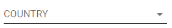
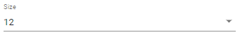
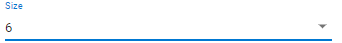
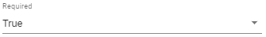
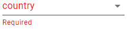

# Como usar un campo date

<figure><figcaption></figcaption></figure>

## Crear un campo date

Click en 

Colocar el mouse dentro de un Column, saldrá una barra violeta.

<figure><figcaption></figcaption></figure>

Hacer click en la barra violeta, se generará un nuevo campo.

<figure><figcaption></figcaption></figure>

Ingresar un nombre al campo y seleccionar el tipo _date_

<figure><figcaption></figcaption></figure>

Hacer click en _OK_

<figure><figcaption></figcaption></figure>

## Cambiar la etiqueta del campo date

Con la propiedad _Label_ se modifica la etiqueta del campo, que por defecto es el nombre del campo.

<figure><figcaption></figcaption></figure>

<figure><figcaption></figcaption></figure>

## Cambiar el tamaño del campo date

Con la propiedad _Size_ se puede cambiar el tamaño de un campo. Se puede escoger un valor entre 1 y 12.

_**Size 12**_

<figure><figcaption></figcaption></figure>

<figure><figcaption></figcaption></figure>

_**Size 6**_

<figure><figcaption></figcaption></figure>

<figure><figcaption></figcaption></figure>

## Hacer requerido el campo date

Con la propiedad _Required en True_, se indica que el campo debe ser completado para poder enviar el formulario.

<figure><figcaption></figcaption></figure>

<figure><figcaption></figcaption></figure>

### Validar formato del date con mascara

Se puede configurar el campo para tener un formato definido, usando el atributo _Mask_. Donde el _**9**_ representa cualquier digito de _**0**_ a **9**, **.** representa el separador decimal, si se utiliza un digito entre **1** y **8** o **\9** se espera ese digito específicamente y el campo lo completa automáticamente.

### Hacer de solo lectura el campo date

Con la propiedad _Readonly_ activada se deshabilita el ingreso o modificacion de los datos de un campo. El campo aparece grisado y con una linea punteada.

IMAGENES

### Hacer visible/invisible el campo date

Se puede hacer que un campo sea o no visible con la propiedad _visibility._

IMAGENES

